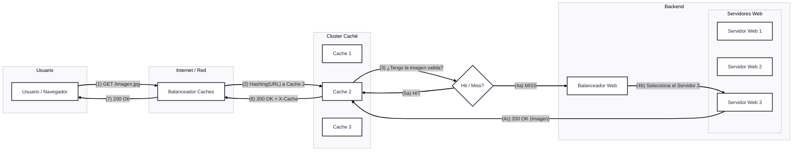

# Módulo 3: Nivel de aplicación. Tema 1: Arquitecturas Distribuidas
## Introducción
Debido a la alta competitividad en los mercados, las empresas no pueden permitir que sus servicios no estén disponibles en determinados momentos o muestren un bajo rendimiento.   
Para construir un servicio hay que tener en cuenta varios componentes: routers, switches, firewalls, cachés, servidores web, clústeres, BBDD
La complejidad de este tipo de infraestructuras es uno de los factores que impulsan su necesidad de conmutación inteligente
Los balanceadores de carga han surgido como una herramienta para aliviar estos problemas.  
El balanceo de carga es un mecanismo que tiene como objetivo el reparto equitativo de la carga a procesar de un sistema entre los recursos disponibles, de manera que no haya caídas de rendimiento en el sistema.

- **Balanceo de comunicaciones**: se realiza el balanceo de conexiones y comunicaciones a través de múltiples rutas hacia el mismo destino, equilibrando la carga entre los distintos recursos de la red (routers).
- **Balanceo de tráfico**: distribuye el tráfico entre los recursos del servidor en lugar de entre los recursos de la red (balanceadores de carga).  

Los balanceadores de carga realizan operaciones sofisticadas: equilibrio de carga, gestión inteligente del tráfico, comprobación, del estado de servidores. Suelen estar colocados en el front-end de centros de procesamiento de datos.

## Clústeres de servidores
Grandes servicios se implementan utilizando clústeres, o granjas de servidores, que están situados en Centros de Proceso de Datos (CPD). Estos clústeres se  utilizan para soportar la alta demanda y garantizar que los servicios no muestren un bajo rendimiento o no estén disponibles.
### Capa física
Se refiere a la colección tangible de servidores que conforman el clúster. Estos servicios están ubicados físicamente en Centros de Proceso de Datos (CPD).  
Un ejemplo de la escala de estos clústeres se ve en Google, que ya en 2015 estimaba que tenía entre 1.5 y 2.5 millones de servidores distribuidos geográficamente por el mundo. En ese nivel, son cruciales aspectos como la refrigeración y la localización física de los servidores
### Capa lógica
<div style="display: flex; align-items: center; gap: 40px;">
  <div style="flex: 1.5;">
    <p>
      Esta capa describe cómo el clúster de servidores se presenta al exterior, especialmente al cliente final.<br>
      Desde la perspectiva del cliente, un clúster funciona como una única máquina (transparencia). Las peticiones del cliente son recibidas por el clúster de forma transparente, dando la impresión de interactuar con una sola entidad, aunque la carga se reparte internamente entre múltiples servidores físicos.<br>
      Un solo clúster puede albergar uno o varios servidores.
    </p>
  </div>
  <div style="flex: 1; text-align: center;">
    
  </div>
</div>

### Alta disponibilidad
La alta disponibilidad se define como la capacidad de un sistema de operar de manera continua, sin fallos, durante un periodo de tiempo determinado. Es crucial en los mercados actuales, donde las empresas no pueden permitir que sus servicios no estén disponibles o muestren un bajo rendimiento.  
Para lograr la alta disponibilidad, se destacan tres principios fundamentales:

- Eliminación de puntos únicos de fallo: identificar y mitigar cualquier componente cuya falla pueda derribar todo el sistema
- Reemplazo de componentes de manera fiable: tener mecanismos para sustituir componentes defectuosos sin interrumpir el servicio
- Capacidad de detección de fallos: implementar sistemas para detectar rápidamente cuándo y dónde ocurren fallos   

Existen indicadores para medir el rendimiento de un sistema en términos de disponibilidad, como el MTBF (Tiempo Medio Entre Fallos) y el MTTR (Tiempo Medio Para Recuperación/Reparar).  
Disponibilidad = $\frac{\text{Tiempo de funcionamiento normal}}{\text{Tiempo total}}$

En la industria de IT, es muy valorada la disponibilidad de los "5 9's" (99,999% del tiempo disponible, lo que equivale a estar indisponible solo 5 minutos al año). Este nivel de disponibilidad se incluye a menudo en los contratos de nivel de servicio (SLAs).
### Arquitectura básica
Para manejar la demanda hay que asegurar que los servicios no muestren un bajo rendimiento o caigan. Es crucial que la infraestructura de los servidores sea escalable. El escalado se refiere a la capacidad de un sistema para manejar una carga creciente.

- Escalado vertical: este enfoque implica mejorar el hardware del servidor existente. Se trata de aumentar la potencia de una única máquina añadiendo más recursos como CPU, RAM o mejorando el almacenamiento  
    - Generalmente, es menos económico, ya que a menudo requiere de dispositivos especializados  
    - La disponibilidad de los recursos IT puede ser más reducida, y las acciones adicionales para realizar el escalado pueden ser necesarias  
    - Los recursos están limitados por su capacidad hardware  

- Escalado horizontal: este enfoque implica añadir más servidores para repartir la carga entre ellos. En lugar de tener una única máquina muy potente, se tienen múltiples máquinas trabajando juntas  
    - Una ventaja importante es que no es necesario modificar la aplicación para que funcione en este esquema distribuido  
    - Es más económico, ya que utiliza componentes convencionales  
    - Los recursos IT están disponibles de manera instantánea, permitiendo el replicado de recursos y escalado automático  
    - Los recursos no están limitados por su capacidad de hardware de una única máquina, ya que se pueden añadir más máquinas según sea necesario  
    - Los balanceadores de carga son una herramienta clave para implementar el escalado horizontal, distribuyendo el tráfico entre los servidores añadidos  

### Implementación de balanceadores
Se implementan en máquinas Linux dedicadas, con varios interfaces de red. Algunos ejemplos pueden ser HAPROXY o Nginx
## Conceptos de Balanceo de Carga
### NAT (NetWork-Address Translation)
NAT es el concepto básico en el balanceo de carga, y se utiliza para redirigir las peticiones del cliente a cada servidor.

- NAT de destino: el elemento de red (router, balanceador) cambia la dirección de destino del paquete. Se usa sobre todo sobre las conexiones entrantes
- NAT de origen: se cambia la dirección de origen y destino. Por ejemplo, para que los paquetes devueltos por un servidor puedan evitar pasar de nuevo por el balanceador


Si hay varias conexiones salientes, el router sabe a cuáles pertenecen por los puertos de origen y destino
Hay diferentes tipos de funcionamiento en NAT:

- **Estática**: una dirección IP privada se traduce siempre en una misma dirección IP pública. Este modo de funcionamiento permitiría a un host dentro de la red ser visible desde Internet.
- **Dinámica**: el router tiene asignadas varias IP públicas, de modo que cada dirección IP privada se mapea usando una de las direcciones IP públicas que el router tiene asignadas, de modo que cada dirección IP privada le corresponde al menos una dirección IP pública.  
Cada vez que un host requiera una conexión a Internet, el router le asignará una dirección IP pública que no esté siendo utilizada. En esta ocasión aumenta la seguridad, ya que dificulta que un host externo ingrese a la red, ya que las direcciones IP públicas van cambiando.
- **Sobrecarga**: PAT (explicado adelante)
### PAT (Port-Adress Translation)
PAT (o NAT con sobrecarga) hace referencia a la traducción del número de puerto en los paquetes TCP/UDP. Este mecanismo proporciona seguridad, escalabilidad y facilita la gestión de las aplicaciones.  

- Ejecutando las aplicaciones en puertos privados, se puede obtener una mejor seguridad manteniendo cerrados los puertos habitualmente utilizados
- PAT ayuda a mejorar la escalabilidad al permitir ejecutar la misma aplicación en varios puertos
- PAT también puede mejorar la gestión en determinadas situaciones: albergar distintas aplicaciones web, con distinto dominio, utilizando la misma IP  

Es el mecanismo más común de todos los tipos y el utilizado en los hogares. Se pueden mapear múltiples direcciones IP privadas a través de una sola dirección IP pública, con lo que evitamos contratar más de una dirección IP pública. Para poder hacer esto, el router hace uso de los puertos. En los protocolos TCP y UDP se disponen de 65.535 puertos para establecer conexiones. De modo que cuando una máquina quiere establecer una conexión, el router guarda su IP privada y el puerto de origen y los asocia a la IP pública y un puerto al azar. Cuando llega información a este puerto elegido al azar, el router comprueba la tabla y lo reenvía a la IP privada y al puerto que correspondan


Cuando una dirección IP privada de una red es una dirección IP pública en uso, el router se encarga de reemplazar dicha dirección IP por otra para evitar el conflicto de direcciones.
## Tipos de Balanceadores (Topología)
### Transparente (In-flow)
En la topologia Transparente (In-flow), el balanceador se encuentra ubicado en la ruta directa del trafico. El trafico fluye a traves del balanceador. 
<div style="display: flex; flex-direction: column; align-items: center;">
  <div style="max-width: 800px;">
    <h2 style="text-decoration: underline;">Proceso de Flujo</h2>
    <ol>
      <li>El usuario solicita un recurso, y la petición (que hace referencia a la IP del balanceador, resuelta por DNS) pasa por el router. El router redirecciona la petición al balanceador.</li>
      <li>El balanceador, utilizando NAT destino, cambia la dirección IP de destino (la del balanceador) por la dirección IP del servidor real seleccionado (RS2 en este caso).</li>
      <li>El servidor real procesa la petición y devuelve la respuesta al balanceador.</li>
      <li>El balanceador procesa esta respuesta y ajusta la dirección IP de origen a la suya propia (usando NAT de origen) para hacer el paquete enrutable y enviarlo finalmente al cliente.<br><br>
          Nuevamente, se emplea NAT de origen para permitir el retorno del tráfico a través del balanceador.<br><br>
          Este proceso implica que el balanceador interviene en ambos sentidos de la comunicación. Esto permite que el balanceador pueda actuar también como proxy, lo que facilita la aplicación de inspección y políticas de seguridad.
      </li>
    </ol>
  </div>
  <div style="max-width: 800px; text-align: center;">
    
  </div>
</div>

**Desventajas**

- El balanceador en sí mismo se convierte en un punto único de fallo y, por lo tanto, debe ser replicado para asegurar la disponibilidad
- Requiere que el balanceador tenga suficiente ancho de banda y capacidad computacional para procesar todo el tráfico entrante y saliente
- El servidor real ve la IP del balanceador como origen, no la IP original del cliente. Esto puede hacer que no se puedan hacer diferencias entre clientes por IP

### One-arm
En la topología One-arm, el balanceador no está en la ruta del tráfico (inflow). Una de sus ventajas es que no requiere de ningún cambio en el diseño de la red original, lo que la hace viable si una empresa busca minimizar cambios en su infraestructura.
<div style="display: flex; flex-direction: column; align-items: center; gap: 20px;">
  <div style="max-width: 800px;">
    <h2 style="text-decoration: underline;">Proceso de Flujo</h2>
    <ol>
      <li>El usuario solicita un recurso, cuya IP es resuelta por DNS y pasa por el router y el switch.</li>
      <li>El balanceador cambia la dirección IP de origen y destino del paquete, utilizando su interfaz privada, para redireccionar la petición al servidor real correspondiente.</li>
      <li>El servidor procesa y devuelve la respuesta al balanceador.</li>
      <li>El balanceador consulta su tabla de sesiones, recupera las direcciones IP de origen y destino finales, y reenvía el paquete al cliente.</li>
    </ol>
    <p>
      En esta topología el balanceador interviene en ambos sentidos de la comunicación (lo que permite aplicar inspección y políticas de seguridad).
    </p>
  </div>

  <div style="max-width: 800px; text-align: center;">
    
  </div>

</div>

**Desventajas**

- El servidor real no conoce la IP de origen de los clientes. Esto puede subsanarse con la cabecera X-FORWARDED-FOR en la petición HTTP
- El balanceador perderá las funcionalidades de proxy, ya que no tiene la posibilidad de analizar la comunicación completa entre el cliente y los servidores reales.
- Ocultar la IP del cliente podría afectar la seguridad y la personalización de sesiones

El balanceador perderá las funcionalidades de proxy, ya que no tiene la posibilidad de analizar la comunicación completa entre el cliente y los servidores reales
### DRS (Direct Server Return)
En la topología DRS el balanceador NO cambia las direcciones IP. En su lugar, modifica las direcciones MAC para redirigir la petición al servidor real correspondiente.

<u>**Proceso de Flujo**</u>

1. El usuario solicita un recurso (dirigido a la IP virtual del balanceador). La petición pasa por el router y el switch.
2. El balanceador recibe la petición
3. El balanceador NO cambia las direcciones IP. En cambio, modifica las MACs (cambiando la MAC de destino a la del servidor real seleccionado) para redirigir la petición al servidor real correspondiente. Según la tabla, la MAC de destino cambia de la del balanceador (M2) a la del servidor real (M4). La IP de origen (cliente) y la IP de destino (virtual) permanecen sin cambios en este paso.
4. La respuesta del servidor real se redirecciona directamente al usuario, sin necesidad de pasar por el balanceador de carga. Esto implica que el servidor real debe enviar la respuesta utilizando la IP virtual como dirección de origen para que el cliente la acepte correctamente, lo que requiere que el servidor esté configurado para "poseer" esa IP virtual.

Cuando el servidor real responde a la petición, utiliza la VIP (la dirección IP virtual) como dirección IP de origen y la dirección IP del cliente como dirección IP de destino. Este paquete de respuesta se envía directamente al usuario, sin necesidad de pasar por el balanceador de carga. Las fuentes y la tabla de flujo de paquetes en y la descripción en confirmar que la respuesta va directamente del servidor real (usando su MAC como origen y la MAC del router/cliente como destino) al cliente, evitando cualquier NAT en la respuesta y, por lo tanto, el balanceador es saltado para el tráfico de respuesta.


**Desventajas**

- Requiere modificar la configuración de los servidores reales. Específicamente, los servidores deben ser configurados para "poseer" la VIP en una interfaz de loopback.
- No oculta la estructura de la red interna tan eficazmente como otras topologías que usan más NAT. Aunque el cliente ve la VIP como origen de la respuesta, la arquitectura requiere que los servidores internos estén configurados con la VIP.
- El balanceador perderá las funcionalidades de proxy, ya que no procesa el tráfico de respuesta y, por lo tanto, no puede analizar la comunicación completa entre el cliente y los servidores reales.

### Ejemplo
Una empresa de comercio electrónico experimenta una alta demanda durante eventos especiales como el Black Friday. Actualmente, cuenta con una infraestructura de servidores distribuida en dos centros de datos. Para mejorar la escalabilidad y disponibilidad, desea implementar un sistema de balanceo de carga, con las siguientes condiciones:

- Los servidores web están replicados en ambos centros de datos y manejan tanto contenido dinámico como estático
- El tráfico web es variable, con picos de hasta 10 veces la carga habitual en eventos especiales.
- Algunos usuarios requieren sesiones persistentes, ya que agregan productos al carrito de compras antes de pagar.
- La empresa quiere minimizar los cambios en su arquitectura de red, evitando modificar las configuraciones de los servidores existentes.
- La seguridad es una prioridad, por lo que se busca una solución que oculte la estructura interna de la red.

¿Qué tipo de configuración de balanceador (In-Flow, One-Arm o DRS) recomendarías para esta empresa? Justifica tu respuesta desde el punto de vista del rendimiento y complejidad de implementación.

Solución: la configuración recomendada es la configuración In-Flow.
In-Flow se basa directamente en uno de los requisitos clave del ejercicio: la empresa quiere minimizar los cambios en su infraestructura existente. La configuración In-Flow coloca el balanceador de carga en el flujo directo del tráfico ("in-flow"), lo que, según la fuente, evita modificar la arquitectura existente.  
Veamos por qué las otras opciones presentadas en la pregunta (DRS y One-Arm) fueron descartadas en esta solución, en el contexto de los requisitos:

1. DRS (Direct Return Server):
    - Esta necesidad de modificar los servidores contradice directamente el requisito de minimizar los cambios en las configuraciones de los servidores existentes.
    - Aunque DRS ofrece un alto rendimiento potencial, especialmente para las respuestas, ya que el tráfico de respuesta no pasa por el balanceador, este beneficio de rendimiento no compensa el requisito estricto de no modificar los servidores en este caso.
    - Además, DRS pierde las funcionalidades de proxy del balanceador en el retorno.
2. One-Arm
    - La solución la menciona como alternativa viable si se requiere mayor rendimiento, indicando (en, aunque la tabla de flujo sugiere lo contrario) que las respuestas del servidor no pasarían por el balanceador, lo cual es una ventaja de rendimiento.
    - Sin embargo, la solución también señala una desventaja significativa de One-Arm: no oculta la IP del cliente (a menos que se use X-FORWARDED-FOR), lo cual podría afectar la seguridad y la personalización de sesiones. Esto va en contra del requisito de seguridad y ocultar la estructura interna de la red.

En contraste, la configuración In-Flow:

- Se coloca en la ruta directa del tráfico
- Utiliza NAT (Network Address Translation). El uso de NAT de destino y origen ayuda a ocultar el direccionamiento interno, cumpliendo el requisito de seguridad y ocultar la estructura.
- Permite al balanceador actuar como proxy y potencialmente como cortafuegos. Esta capacidad de proxy es importante para implementar la persistencia de sesión requerida (por ejemplo, mediante el análisis de cookies con delayed binding).
- Lo más importante para este caso específico, no requiere modificar la arquitectura existente de los servidores.

## Tipos de Balanceadores de Carga (Niveles)
### Gestión de Conexiones (nivel de red)
Este tipo de balanceo opera en el nivel de red (Capa 4). Toma decisiones "sencillas" basadas en parámetros de este nivel, como las direcciones IP y los puertos de origen y destino en los paquetes TCP/UDP. No requiere inspeccionar el contenido de la aplicación.  
Para evitar cuellos de botella y caídas de rendimiento, los balanceadores de carga utilizan distintos algoritmos, que se dividen en dos grandes grupos:

- Algoritmos estáticos: reparten la carga entre el número de servidores, de tal manera que todos los servidores procesan la misma cantidad de peticiones (posibilidad de desbalanceo). En este tipo de algoritmos destaca el Round Robin (turno rotativo). Este algoritmo asigna las peticiones de manera ordenada y cíclica entre los servidores. De esta forma, todos los servidores reciben el mismo número de peticiones

<h3>Algoritmos dinámicos</h3>
Tienen en cuenta el estado actual de cada servidor y distribuyen el tráfico en consecuencia. Hay dos algoritmos principales:
<div style="display: flex; align-items: start; gap: 20px;">
  <div>
    <ul>
      <li><strong>Menos conexiones:</strong> Comprueba qué servidores tienen menos conexiones abiertas en ese momento y envía el tráfico a esos servidores. Esto supone que todas las conexiones requieren aproximadamente la misma potencia de procesamiento.</li>
      <li><strong>Basado en carga:</strong> Distribuyen la carga en función de los recursos de que disponga cada servidor en ese momento. El servidor mide la CPU y la memoria disponibles, y el balanceador de carga consulta al servidor antes de distribuir el tráfico.</li>
    </ul>
  </div>
  <div>
    
    
  </div>
</div>

### Datos de aplicación (nivel de aplicación)
Este tipo de balanceo opera en el nivel de aplicación (Capa 7), típicamente para protocolos como HTTP. Para tomar mejores decisiones, especialmente para el mantenimiento de la sesión de una aplicación, el balanceador debe "entender" la semántica de la aplicación. Esto es crucial porque las aplicaciones a menudo necesitan identificar y mantener el estado de las acciones del usuario a través de múltiples conexiones desde el mismo navegador, algo que el balanceo puramente de nivel de red (basado solo en IP/puerto) no puede garantizar eficazmente. 
#### Coherencia de datos  
Los conceptos de Coherencia de Datos y Persistencia de Sesión son cruciales en el contexto de las Arquitecturas Distribuidas y el Balanceo de Carga. En una arquitectura distribuida con balanceo de carga, es habitual que el navegador de un usuario abra múltiples conexiones a con un servicio. Sin un manejo específico, el servidor que atiende estas conexiones puede cambiar cada una de ellas debido al balanceo. Esto genera problemas cuando la aplicación debe identificar y mantener el estado de las acciones del usuario.
Pueden plantearse soluciones a nivel de:

- Aplicación: mover la BD a un único host virtual, haciendo que todos los servidores la utilicen. Inconvenientes:
    - Hay que modificar las aplicaciones Web para adaptarse al cambio
    - La BD se convierte ahora en un punto único de fallo: hay que incluir balanceo y alta disponibilidad para ella
- Arquitectura: utilizar técnicas específicas para mantener las conexiones de un mismo usuario en el mismo servidor → persistencia de sesión  
Dos tipos de persistencia de sesión:
- Sin información adicional, un balanceador de carga solo podrá utilizar datos de red/transporte (como IP y puertos de origen/destino del paquete TCP) para intentar la persistencia de sesión
- Para tomar mejores decisiones en el mantenimiento de sesión de una aplicación, el balanceador debe ser capaz de "entender" la semántica de la aplicación, típicamente protocolos como HTTP. Esto significa analizar información de la capa de aplicación, como las URLs solicitadas y las cookies intercambiadas

#### Delayed Binding
Delayed Binding consiste en retrasar la vinculación de una conexión TCP a un servidor, hasta que el cliente complete la conexión TCP y envíe datos de la aplicación.

- En este proceso, el balanceador completa la configuración de la conexión TCP con el cliente actuando en nombre del servidor. Esto le permite al balanceador ponerse en el medio de la comunicación entre el cliente y el servidor
- Al estar en esta posición intermedia, el balanceador puede analizar los datos de la capa de aplicación que se intercambian (como un HTTP GET, información de Cookies, etc.)
- Basado en el análisis de estos datos de aplicación, el balanceador puede entonces tomar la decisión de enrutamiento más adecuada para la conexión
-  Una vez que el balanceador puede analizar datos como cookies y URLs mediante Delayed Binding, puede aplicar técnicas como los métodos basados en cookies (lectura, inserción, reescritura) o URL switching para dirigir las peticiones posteriores del mismo usuario al servidor correcto y mantener la persistencia de sesión.
- Desventaja: La principal desventaja mencionada del Delayed Binding es una posible pérdida de rendimiento en la traducción.


#### Métodos basados en cookies
Una vez que el balanceador puede analizar los datos de la capa de aplicación gracias al Delayed Binding, puede implementar métodos de persistencia de sesión más inteligentes, como los basados en cookies.  
Existen tres métodos esenciales de realizar intercambio de cookies: lectura, inserción y reescritura de cookies.  
<u>**Cookie-Read**</u>  
La primera petición de un cliente es dirigida a un servidor real (RS) (por ejemplo, a través de un algoritmo como round-robin, facilitado por delayed binding para inspeccionar si ya tiene la cookie). El servidor real crea una cookie específica (ej. ```server=1```) para ese cliente. El navegador almacena la cookie. En las peticiones subsiguientes, el navegador envía la cookie en la cabecera HTTP. El balanceador de carga lee esta cookie (```server=1```) y utiliza su valor para dirigir la conexión al mismo servidor (RS1)

- Ventajas: Menos overhead en el balanceador
- Desventajas: Requiere que la aplicación del servidor sea modificada para crear una cookie específica con su ID. El servidor debe conocer su propia identificación. El administrador debe mantener la configuración del servidor (su ID) sincronizada con la configuración del balanceador.


<u>**Cookie-Insert**</u>  
A diferencia del método anterior, el balanceador de carga es ahora el encargado de crear e insertar la cookie en la respuesta del servidor. El balanceador añade una cookie (ej. ```server=1```) a la respuesta HTTP antes de enviarla al cliente. El navegador recibe y almacena la cookie. En las peticiones posteriores, el navegador envía la cookie, y el balanceador la lee para dirigir el tráfico al servidor correcto [similar al cookie-read]

- Ventajas: Este método es totalmente transparente para las aplicaciones del servidor, ya que no necesitan crear ni gestionar una cookie específica para la persistencia.
- Desventajas: Genera sobrecarga ("overhead") en el balanceador y puede inducir latencia. El balanceador tiene que manipular el paquete de respuesta para insertar la cookie. Esto puede requerir copiar el paquete en memoria. La inserción de una cookie aumenta el tamaño del paquete, lo que puede causar que el paquete se fragmente (divida en dos) si excede el tamaño máximo permitido. El balanceador debe manejar la posible retransmisión y ajustar la traducción de números de secuencia en caso de fragmentación.


<u>**Cookie-Rewrite**</u>  
Este método trata de mitigar los problemas de rendimiento de la inserción de cookies. El servidor incluye una cookie por defecto (ej. ```server=1```) con un formato predefinido. El balanceador simplemente sustituye el valor por defecto (XXX) por el identificador del servidor real que envió la respuesta (ej. ```server=1```)

- Ventajas: El paquete no se incrementa en longitud como en la inserción, y no se realiza reasignación de memoria. Esto mejora el rendimiento comparado con la inserción pura.
- Desventajas: Aunque no se menciona explícitamente en las fuentes proporcionadas, esta técnica aún requiere cierta cooperación o conocimiento del formato esperado de la cookie por parte del servidor (para incluir el valor por defecto XXX), a diferencia de la inserción pura que es totalmente transparente.


#### URL switching
En lugar de distribuir peticiones basándose solo en la disponibilidad del servidor (como Round Robin o Menos Conexiones), el balanceador examina la URL de la petición HTTP para determinar a qué servidor o grupo de servidores debe enviarla.  
Necesario cuando los servidores en un clúster no son iguales o no contienen todo el contenido 
La capacidad de analizar la URL es posible gracias al Delayed Binding.   
Esto permite:

- Adaptarse a situaciones de "flash-crowd": permite dirigir el tráfico para una URL específica (por ejemplo, ```/lanzamiento``` de un nuevo producto) a un grupo de servidores dedicado, aislando así la carga y asegurando que, si ese grupo falla, no afecta al sitio principal (```www.superdominio.com```). Esto contribuye a la resiliencia y disponibilidad del servicio general
- Separacion de contenido: es habitual usarlo para enviar contenido estático (imágenes, videos) a servidores optimizados para ello (discos más rápidos, mayor ancho de banda), mientras que el contenido dinámico se envía a otros

## Alta Disponibilidad
La alta disponibilidad para balanceadores implica típicamente el uso de dos balanceadores de carga trabajando en pareja para tolerar el fallo de uno de ellos. Este concepto es similar al utilizado en routers con VRRP (Virtual Router Redundancy Protocol). Hay dos modos de configuración de Alta disponibilidad:

- Activo-Pasivo: en esta configuración, un balanceador está activo (procesa el tráfico y realiza el balanceo), mientras que el otro permanece en espera (standby), sin procesar tráfico ni responder a peticiones.
Dos balanceadores de carga (LB1 y LB2) configurados en activo-pasivo, donde LB1 está activo y LB2 está en espera. Si LB1 falla, LB2 toma el control.
- Están conectados a través de un enlace dedicado y comprobando constantemente el estado del otro (heart-beat)
- Si LB1 activo falla, la unidad LB2 toma el control inmediatamente
    - LB2 (anteriormente pasivo) anuncia que ahora posee la VIP y su dirección MAC asociada mediante un ARP gratuito (ARP: IP ←→ MAC: M5)
- Si el router falla (punto único de fallo), no hay solución, pérdida total de la conectividad


- Activo-Activo: en esta configuración, ambos balanceadores de carga trabajan simultáneamente, procesando tráfico y balanceando la carga, a la vez que actúan como respaldo uno para el otro
Ambos balanceadores trabajan a la vez: si uno falla, el otro recibe inmediatamente su tráfico. Existen dos opciones de configuración:
- Múltiples IPs por balanceador:
    - Un balanceador (LB1) está activo para VIP1 y en espera para VIP2, mientras que el otro (LB2) está activo para VIP2 y en espera para VIP1. Si LB1 falla, LB2 toma el control de VIP1 y atiende a ambas VIPs.
    - Las solicitudes se reparten por DNS + Round Robin
- Única IP para balanceador:
    - Únicamente un balanceador responde a la vez

  

### Modelo 1. Configuración Activo - Pasivo, única IP, servidores directamente asociados
En este modelo, los servidores están directamente asociados a los balanceadores. Especificamente, los servidores se dividen entre los dos balanceadores. Los servidores conectados al balanceador pasivo se encuentran desconectados o con muy poco uso. Aunque el diseño es simple, presenta varias limitaciones importantes:

- Muchos servidores quedan sin uso o con poco uso
- Si el balanceador activo falla, el balanceador pasivo toma el control, pero solo puede utilizar los servidores que están directamente asociados a él
- Si un balanceador falla, se pierden todos los servidores conectados a ese balanceador.
- El router sigue siendo un punto único de fallo


### Modelo 2. Configuración Activo - Activo, múltiples IPs, servidores conectados
Mejora con respecto al modelo 1.

- Configuración Activo-Activo: a diferencia del modelo 1, donde uno estaba activo y otro en espera. Esto permite mayor rendimiento de balanceo de carga porque ambas unidades trabajan al mismo tiempo. Si uno falla, el otro asume la carga del fallido
- Múltiples IPs: La configuración activo-activo en este modelo se implementa usando múltiples IPs virtuales (VIPs). Un balanceador (LB1) está activo para VIP1 y en espera para VIP2, mientras que el otro (LB2) está activo para VIP2 y en espera para VIP1. Si LB1 falla, LB2 toma el control de VIP1 y atiende a ambas VIPs.


### Modelo 3. Configuración Activo - Activo, múltiples IPs, servidores totalmente conectados
Configuración Switch Layer 2 para todos los servidores: la característica definitoria del modelo 3. Este switch interconecta a todos los elementos, balanceadores y servidores. A diferencia del modelo 1, donde los servidores se dividían y asociaban directamente a cada balanceador, en este modelo, todos los servidores están conectados al mismo switch y ambos balanceadores se conectan a este switch.  

El modo de operación es similar al modelo 2: Ambos balanceadores trabajan simultáneamente, lo que permite obtener un mayor rendimiento de balanceo de carga. La operación Activo-Activo se implementa utilizando múltiples IPs virtuales (VIPs); por ejemplo, un balanceador activo para VIP1 y el otro activo para VIP2.

Consideraciones de configuración (VIPs, Gateway, NAT/DSR): Para que la alta disponibilidad de servidores funcione en este modelo, cada VIP debe estar asociada (bind) a los servidores conectados a ambos balanceadores. Si una VIP solo se asociara a un subconjunto de servidores, la falla del balanceador que gestiona esa VIP podría limitar el acceso a esos servidores. La configuración del default gateway en los servidores también es importante; si no apunta al balanceador correcto para el tráfico de respuesta, puede generar flujos asimétricos que requieren Source NAT o DSR (Direct Server Return). Las fuentes mencionan que el uso de una VIP compartida (aunque menos común en activo-activo) podría evitar problemas de flujo de retorno.  

A pesar de proporcionar alta disponibilidad para los balanceadores de carga y permitir el acceso a todos los servidores, el modelo 3 todavía tiene puntos únicos de fallo. Especialmente, el router sigue siendo un punto único de fallo y el switch Layer 2 también es un punto único de fallo (si falla, los balanceadores pierden el acceso a los servidores)


### Modelo 4. 
La característica definitoria y la mejora clave del modelo 4 es que aborda el punto único de fallo que representa el único switch Layer 2 en el modelo 3. En el modelo 4 se utilizan varios switches para evitar que un solo switch se convierta en un punto único de fallo. 
Organización del tráfico:

- División de servidores:
    - VIP1 (LB1) se asigna a RS1 y RS2
    - VIP2 (LB2) se asigna a RS3 y RS4
- Default gateway:
    - RS1 y RS2 usan como gateway al Load Balancer 1 (IP1 = 10.10.10.1).
    - RS3 y RS4 usan como gateway al Load Balancer 2 (IP2 = 10.10.10.2).

Esto permite que el tráfico de entrada y salida fluya de forma simétrica, evitando problemas de retorno de tráfico por rutas no esperadas.


### Modelo 5.
La característica definitoria y la mejora clave del modelo 5 es que aborda el punto único de fallo que representa el único router en el modelo 4. Para lograr la alta disponibilidad a nivel de router, el modelo 5 utiliza dos routers de capa superior. La redundancia para estos routers es proporcionada utilizando VRRP (Virtual Router Redundancy Protocol). VRRP permite que dos o más routers actúen como respaldo uno del otro. En este modelo, se utilizan dos direcciones IP VRRP, donde cada router posee activamente una de ellas.  

Para aprovechar ambos routers activos, el tráfico saliente (outband traffic) de los balanceadores de carga se puede distribuir entre los dos routers. Esto se puede configurar, por ejemplo, haciendo que el Balanceador de Carga 1 apunte a la IP VRRP1 y el Balanceador de Carga 2 apunte a la IP VRRP2 para el trafico de salida. Alternativamente, se pueden definir múltiples rutas estáticas en cada balanceador de carga, permitiendo la distribución del tráfico a través de ambas IPs VRRP. Introduce el uso de trunk groups para conectar los diferentes componentes (como balanceadores de carga y switches). Un trunk group consiste en dos o más enlaces utilizados para conectar dos dispositivos, ofreciendo tanto escalabilidad (aumentando el ancho de banda agregado) como tolerancia a fallos (si un enlace falla, la carga se distribuye automáticamente entre los enlaces restantes). Esto mitiga el problema de falla de un solo enlace que podía afectar la funcionalidad de un balanceador de carga o router en diseños anteriores. 

A pesar de resolver la redundancia del router y mejorar la disponibilidad de los enlaces mediante trunk groups, el modelo 5 presenta una limitación significativa, ya que si un switch falla, tendremos la mitad de servidores inactivos


### Modelo 6.
El modelo de alta disponibilidad 6 se presenta como la etapa más avanzada en la serie incremental de diseños de alta disponibilidad. Su principal objetivo es ofrecer el nivel más alto de disponibilidad y abordar los puntos únicos de fallo que persisten en modelos anteriores, como el modelo 5.

El modelo 6 aborda y elimina el router como punto único de fallo (al igual que el modelo 5), pero para mejorar la resiliencia en las capas inferiores, este diseño introduce switches Layer 2/3 que conectan directamente con los servidores. Además, se utilizan trunk groups para las conexiones entre componentes clave (como balanceadores de carga y switches), lo que proporciona tanto escalabilidad (mayor ancho de banda agregado) como tolerancia a fallos a nivel de enlace. Si un enlace falla en un trunk group, la carga se redistribuye automáticamente entre los enlaces restantes, mitigando un problema de fallo de enlace individual que podía afectar a modelos anteriores.  

Un beneficio clave de este diseño es que la falla de un balanceador de carga no afecta la conectividad a los servidores.  

Tres enfoques principales para la implementación de este diseño, cada uno con diferentes implicaciones para el rendimiento y la configuración.

- Direct Server Return (DRS): considerado el más eficiente por ofrecer un alto rendimiento. La VIP se configura como una dirección de loopback en los servidores. Las respuestas de los servidores van directamente al cliente sin pasar por el balanceador de carga. El default gateway de los servidores debe apuntar a las IPs VRRP de los routers. No permite el balanceo basado en capas 5/7 como cookies o URLs (no permite delayed binding)
- Enlazar VIPs a un subconjunto de servidores y configurar el Default Gateway al balanceador correspondiente: por ejemplo, enlazar VIP1 a RS1 y RS2, y configurar el default gateway de estos servidores a la IP del gateway en LB1. Esto asegura que el trafico de respuesta regrese por el balanceador correcto, evitando flujos asimétricas. Si un balanceador falla, el otro toma el control de su VIP y gateway IP, pudiendo acceder a todos los servidores
- Source NAT: ofrece la mayor flexibilidad al permitir enlazar cualquier VIP a cualquier servidor. Similar al método anterior, todo el trafico pasa dos veces por el enlace entre el balanceador y el switch L2. Permite el balanceo basado en capas 5/7. La principal desventaja es que los servidores no ven la dirección IP de origen real del cliente. 

Consideraciones de Complejidad: A pesar de ofrecer la máxima disponibilidad, las fuentes advierten que los diseños más complejos son más difíciles de implementar y depurar, y son más susceptibles a errores humanos. Un diseño simple con status failover podría ser preferible en ciertos escenarios.


## Balanceo de carga y cachés
Una caché almacena contenido estático al que se accede con frecuencia para mejorar el tiempo de respuesta y reducir el trafico de red. Generalmente, las cachés no pueden almacenar contenido dinámico. Las caches son elementos significativos en las redes modernas y, como tales, también pueden ser balanceadas.

El balanceo de carga aplicado a las cachés puede tener distintos objetivos:
- Aceleración del cliente: mayor rapidez de respuesta a los clientes y ahorro de ancho de banda de red
- Aceleración del servidor: entrega de contenidos más rápida y ahorro en el número de servidores

También existen dos diferentes tipos de balanceo

- Balanceo de carga sin estado
- Balanceo de carga con estado

### Caches del lado del cliente
#### Forward proxy
Un proxy forward se instala en la red de los clientes, y almacena el contenido más habitual de su navegación

- Requiere que cada navegador del usuario sea configurado explícitamente para apuntar a este servidor proxy. El navegador utiliza un protocolo especial para dirigir todas las peticiones a la caché, que recupera el contenido en nombre del usuario final. Esta configuración puede ser automatizada mediante scripts.
- Ofrece mayor seguridad porque los administradores de red pueden permitir el acceso a internet únicamente a los servidores de caché proxy, denegando el acceso directo a otros. Esto oculta la dirección IP real de cada usuario final, ya que los servidores de origen ven la caché proxy como el usuario final.

Sin embargo, el despliegue presenta desafíos importantes desde la perspectiva del cliente y su gestión.

- La necesidad de configurar todos y cada uno de los navegadores.
- Existen problemas de escalabilidad. Si una caché está diseñada para un número limitado de usuarios, y la red tiene muchos más, se necesitarán múltiples cachés para repartir la carga. Sin embargo, particionar la carga entre ellos se convierte en un problema.
- La disponibilidad es un cuello de botella. Si la caché falla, se pierde el acceso a Internet para los usuarios que dependen de ella. Esto la convierte en un punto único de fallo y habría que hacerla redundante.


#### Proxy transparente
Funciona de forma "transparente" para el usuario → no es necesario configurar los navegadores de los usuarios. Al desplegar una caché como proxy transparente, se evita la necesidad de configurar explícitamente el navegador de cada usuario para que apunte al servidor de caché proxy. Se logra colocando la caché en la ruta de la conexión a internet. Dado que todo el trafico pasa por la caché, esta puede interceptar (terminar) las conexiones de tráfico web (por ejemplo, en el puerto 80) y atenderlas desde la caché misma si tiene el contenido, o ir a los servidores de origen si no lo tiene. Los usuarios pueden que ni siquiera sean conscientes de que hay una caché desplegada.

Aunque la transparencia tiene una gran ventaja desde la perspectiva del cliente y la administración, el despliegue de un proxy transparente presenta problemas significativos, particularmente en el contexto de la fiabilidad y escalabilidad requeridas en arquitecturas distribuidas.

- Se convierte en un punto único de fallo. Si la caché falla, se pierde completamente el acceso a Internet para los usuarios que dependen de ella, y no solo el trafico web. Esto lo convierte en un cuello de botella de disponibilidad y dificulta la gestión, como actualizaciones de software o la sustitución de hardware
- Escalar con múltiples cachés transparentes es difícil debido a la topología de red; puede haber solo uno o dos enlaces de acceso a internet, lo que limita la capacidad de desplegar más de una caché en cada ruta de acceso a internet.


### Cachés del lado del servidor
#### Proxy inverso 
Se trata de un proxy para servidores, situado en su red, y no en la del cliente. Su objetivo es el mismo: acelerar la devolución de contenido estático (típicamente multimedia)  
Cuando se despliega un proxy inverso caché frente a un servidor web, las peticiones de los usuarios son recibidas por la caché en lugar de directamente por el servidor web. Si la caché no tiene el objeto solicitado, lo pide al servidor web para recuperarlo.

- Requiere configurar la entrada DNS del dominio para que apunte a la dirección IP del proxy inverso, en lugar de la IP del servidor origen. Las peticiones llegan primero al proxy
- Ventajas:
    - Respuesta más rápida desde los servidores.
    - Reducción de la carga en los servidores de origen.
- Desventajas:
    - Requiere la configuración de la IP del proxy en el DNS, en lugar de la IP del servidor.

Si la caché proxy falla, la petición puede ser redirigida a los servidores de origen. Sin embargo, para desplegar múltiples servidores de caché proxy inverso con fines de escalabilidad y disponibilidad, es necesario desplegar un balanceador de carga frente a ellos. El balanceo de carga en cachés proxy inverso es exactamente igual al balanceo de carga en servidores. Definimos una VIP en el balanceador de carga y la unimos a una aplicación específica (puerto) que está siendo cacheada. Para el balanceador, el proxy inverso es un servidor web.


1. La resolución DNS del dominio apunta al proxy, no a los servidores
2. Si la caché del proxy falla, redirige la petición a los servidores reales
3. Puede asegurarse su disponibilidad incluyendo un balanceador delante del proxy

#### Proxy inverso transparente
Funciona de forma "transparente" para el DNS → no es necesario incluir entradas para los proxys-caches.  
Desde la perspectiva del servidor, el despliegue de un proxy inverso transparente implica típicamente la utilización de un balanceador de carga. Se despliega un balanceador de carga frente a la granja de servidores web, y se configura una VIP para cada sitio web.   
El flujo de la petición sería:

1. El balanceador de carga redirige la petición de forma transparente a un proxy (cache)
2. Si la caché no tiene el objeto (cache miss) o si la petición es para contenido dinámico (que las cachés generalmente no almacenan), la petición vuelve al balanceador
3. El balanceador, entonces, aplica su lógica de balanceo de carga habitual y distribuye la petición a cada uno de los servidores de origen
4. La respuesta vuelve del servidor de origen
5. La caché, si el contenido es cacheable, se actualiza con la respuesta recibida del servidor
6. Finalmente, la respuesta se envía al cliente

Este esquema ofrece importantes ventajas:

- Transparencia para el DNS: elimina la necesidad de modificar las entradas DNS para apuntar a la caché, simplificando la gestión, especialmente cuando hay múltiples servicios o servidores detrás
- Mayor disponibilidad: si la caché falla, el balanceador de carga simplemente envía el trafico directamente a los servidores web. Esto evita que la caché se convierta en un punto único de fallo
- Escalabilidad: si una caché no puede manejar la carga sé, se pueden añadir más cachés y el balanceador distribuye la carga entre ellas
- Separación de roles: permite que el balanceador de carga se concentre en el balanceo de servidores, mientras que la caché se dedica a la aceleración de contenido estático. Esto es crucial en arquitecturas complejas con múltiples servidores detrás del proxy inverso
- Flexibilidad para servicios premium: facilita a que los proveedores de alojamiento web ofrezcan la aceleración como un servicio adicional, aplicando la política de redirección a la caché solo para los clientes que pagan por ella.
Una desventaja mencionada es que este esquema puede requerir de la configuración de múltiples IPs en el balanceador, una para cada servicio.  

<u>**Ejemplo**</u>: Cloudflare  
Los sitios web redirigen todo su tráfico a través de los servidores de Cloudflare para acelerar la entrega de contenido y beneficiarse de características adicionales como protección contra ataques DoS. Esto demuestra cómo el concepto de proxy inverso transparente puede ser implementado a gran escala para beneficiar a múltiples servidores (sitios web)

### Métodos de balanceo en cachés
Las cachés, como cualquier otro elemento, también deben ser balanceadas.  
Los algoritmos más utilizados están basados en hashing.  
El método de balanceo de carga entre cachés es diferente del balanceo de carga entre servidores. Mientras que el balanceo de servidores busca el servidor menos cargado, el balanceo de cachés debe considerar el contenido disponible en cada caché para maximizar la tasa de aciertos (cache-hit ratio). Es indiferente enviar una solicitud para un objeto ya presente en una caché a otra caché distinta, ya que esta última tendra que obtener el objeto del servidore de origen. El balanceador deberia "recordar" en que cache se encuentra un objeto.  
Hay dos metodos de balanceo:

- Balanceo de carga sin estado (Stateless): similar al balanceo de servidores sin estado.
    - El balanceador calcula un valor hash basado en campos del paquete
    - La elección de los campos para el hash es importante para minimizar la duplicación de contenido (ej. usar IP de destino) y mejorar la distribución de carga (ej. incluir puerto de destino o IP de origen). Sin embargo, basarse solo en IP/puerto no garantiza una distribución óptima si la mayoría del tráfico va a una única IP de destino.
    - Limitación clave: Este método no resuelve eficazmente el problema de la duplicación de contenido entre cachés, ya que no se basa en el identificador del contenido (la URL).
- Balanceo de carga con estado (Stateful): tienen en cuenta la entrada en cada cache. Puede proporcionar una distribucion de carga mas granular y eficiente que el balanceo sin estado. Hay dos tipos.

#### Hashing basado en URL o clave
Distribuye las peticiones aplicando una función de hash a la clave (URL) y usando el módulo del número total de servidores para elegir el destino.

1. Input: URL (/ruta/al/recurso.jpg).
2. Hash: Calcular_hash(URL) -> valor_hash_numerico.
3. Módulo: indice_servidor = valor_hash_numerico % N (donde N = n.º total de servidores).
4. Destino: enviar la petición al servidor con ese indice_servidor.

Tiene un requisito importante y este es que para poder utilizar la URL en la decisión de balanceo, el balanceador tiene que tener acceso a la información de la capa de aplicación, luego se tiene que realizar un delayed binding  

Ventajas:

- Elimina la duplicación de contenido
- Maximiza la tasa de aciertos de la caché
- Es determinista: la misma URL siempre se dirige a la misma caché (si el número de cachés no cambia)
- Proporciona una distribución de carga aceptable si la función hash es buena y el número de cachés es estable

Desventajas:

- Alta sensibilidad a cambios en el número de cachés (N): si se añade o quita una caché, el valor de N cambia, y la operación de módulo hará que la mayoría de las URLs se mapeen a cachés diferentes. Esto provoca una invalidación masiva del contenido almacenado ("cache churn") y degrada significativamente el rendimiento durante la transición
- Como se ha dicho anteriormente, requiere delayed binding, lo que añade complejidad y puede impactar en el rendimiento del balanceador

#### Algoritmos hash
El diseño del algoritmo hash es importante, buscando un buen equilibrio entre velocidad y una distribución uniforme de claves. No se necesita un algoritmo criptográficamente seguro (aunque puede utilizarse), ya que el objetivo principal no es la seguridad contra ataques maliciosos, sino la buena distribución y el rendimiento.
MurmurHash:

- Muy popular para este caso de uso.
- Es un algoritmo no criptográfico
- Diseñado para ser muy rápido
- Ofrece una excelente distribución de las claves (baja tasa de colisiones accidentales y buena dispersión en el anillo)
- Ampliamente disponible en librerías de muchos lenguajes de programación

**Hash consistente**  
Propósitos:

- Está diseñado para minimizar la reorganización de claves cuando el conjunto de servidores (caches) cambia
- Funciona definiendo un espacio numérico abstracto (por ejemplo, de 0 a 2^32-1) como anillo hash
- Tanto los servidores (o cachés, como nodos) como las claves (URLs o recursos) se mapean dentro de este anillo utilizando una función hash. Por ejemplo, se calcula has(id_servidor) y hash(URL)
- Una clave se asigna al primer nodo cuyo identificador (valor hash mapeado) sea igual o mayor que el identificador de la clave

Ventajas:

- Estabilidad: La principal ventaja es su estabilidad ante cambios en el tamaño del clúster. Añadir o quitar una caché solo afecta a una pequeña fracción de las claves; específicamente, aquellas que "apuntaban" a la caché afectada o a su predecesor inmediato en el anillo.
- Minimiza el "Cache Churn": Esto reduce drásticamente la invalidación masiva de caché (cache churn) que ocurre con el hashing simple al cambiar el número de cachés.
- Es ideal para sistemas distribuidos modernos, Redes de Entrega de Contenido (CDNs), clústeres de caché elásticos y aplicaciones a gran escala.
- Se considera el estándar de facto en este tipo de entornos.

## Flujo completo de una peticion


1. El balanceador de carga (LB) envía la petición a la caché seleccionada (ej. Cache_2) basándose en el hash de la URL.
2. Cache_2 busca el recurso localmente. No lo encuentra (es un "miss").
3. Cache_2 actúa ahora como un cliente HTTP. Utiliza la información de configuración
que tiene sobre cuáles son los servidores de origen (back-end) a los que debe preguntar.
4. Cache_2 realiza una petición HTTP GET al servidor de origen para obtener /imagen.jpg.
5. El servidor de origen responde a Cache_2.
6. Cache_2 almacena el recurso (si es cacheable) y luego envía la respuesta final de vuelta al LB.
7. El LB envía la respuesta al usuario.

## Métodos utilizados por el balanceador de carga para optimizar cachés
### Hash Buckets
El método implica calcular un valor hash utilizando campos seleccionados, como la dirección IP de destino. Este valor hash se mapea a un número entre 0 y H, donde H es el número de hash buckets.

Inicialmente, cada bucket está sin asignar. La primera vez que se recibe una conexión cuya petición tiene un valor has que cae en un bucket no asignado, el balanceador de carga utiliza un método de balanceo de carga con estado, como el de "menos conexiones", para seleccionar una caché con la menor carga disponible y asigna ese caché a ese bucket especifico. Todas las sesiones y paquete posteriores cuyo valor hash pertenezca a ese bucket serán reenviados a la caché asignada. Este enfoque requiere que el balanceador de carga rastree la carga en las cachés para asignar los buckets de manera adecuada.

- Granularidad y distribución: La granularidad y la distribución eficiente de la carga mejoran al aumentar el valor de H (el número de cubetas). Por ejemplo, un método que usa 1.024 cubetas puede proporcionar una mejor distribución de la carga que uno con 256.
- Combinación con URL Hashing: El URL Hashing, que utiliza la URL para el cálculo del hash y que busca eliminar completamente la duplicación de contenido entre cachés, puede utilizarse con el método de Hash Buckets.