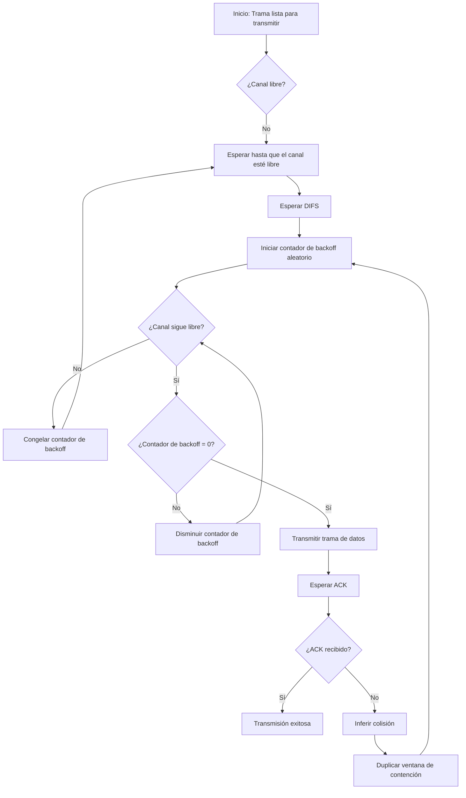
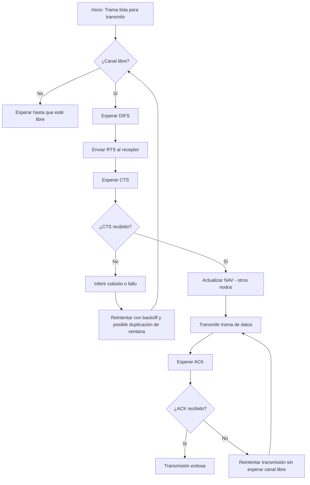

# Módulo 3: Nivel de aplicación. Tema 3: Redes Inalámbricas 
## Introducción 
### Elementos de una red inalámbrica 

- Hosts inalámbricos: Dispositivo que utiliza una conexión inalámbrica para la comunicación. Ejemplos: portátiles, smartphones, IoT. Pueden ser estacionarias o móviles. 
- Estación base: Elemento fundamental en muchas arquitecturas de red inalámbrica. En el contexto de las redes 802.11 (Wi-Fi), la estación base se denomina específicamente Punto de Acceso (AP). La función principal de la estación base es conectar los hosts inalámbricos a una red cableada más grande, actuando como un repetidor que envía paquetes entre la red cableada y los hosts dentro de su área de cobertura, conocida como celda o Basic Service Set (BSS). 
- Enlaces inalámbricos: Se utilizan para conectar dispositivos móviles a la estación base. También se pueden utilizar como enlace troncal. El protocolo de acceso múltiple coordina el acceso al enlace. Diferentes velocidades y distancias de transmisión, bandas de frecuencia. 

 

### Modos de redes 

- Modo Infraestructura: Las estaciones base conectan dispositivos móviles a la red cableada. (Ejemplo: Torre repetidor da conexión a hosts inalámbricos que están a su alcance) 
- Handoff: proceso mediante el cual los dispositivos móviles cambian de estación base sin interrupciones. 
- Modo Adhoc: Sin estaciones base. Los nodos solo pueden transmitir a otros nodos dentro del alcance de su cobertura. Los nodos se organizan en una red: se enrutan entre sí. 

 

#### Modo Adhoc - Aplicaciones 
**VANETs (Vehicular Adhoc NET works)**   
Se clasifican como redes de Múltiples saltos Adhocs. Esto significa que los nodos en una VANET no conectan a una estación base ni a una red más grande como Internet. En su lugar, los nodos se enturan entre sí. Esto implica que un nodo puede tener que retransmitir a través de varios nodos inalámbricos para poder alcanzar a otro nodo dentro de la red VANET. A diferencia de las redes en Modo Infraestructura, no existe una conexión a una Internet amplia.  
Dos principales aplicaciones: 

- Seguridad: Incluyen avisos de ángulos muertos, control de crucero adaptativo, detección de frenadas fuertes y comunicación en situaciones de emergencia (como con ambulancias). 
- Gestión del tráfico: Abarcan la conducción autónoma completa, la planificación óptima del tráfico, y proporcionar entretenimiento e información contextual. 

### Taxonomía de las redes inalámbricas

| | Único salto | Múltiples saltos| 
|---|-------------|-----------------| 
|Infraestructura|El host conecta a la estación base (WiFi, móvil) que conecta a una red más grande|El host puede tener que retransmitir a través de varios nodos inalámbricos para conectarse a una red más grande. Internet: red en malla| 
|Adhocs|No conectan a una estación base ni a una red más grande (Bluetooth, ad hoc nets)|Sin estación base, sin conexión a una Internet más amplia. Puede tener que retransmitir para llegar a otro nodo inalámbrico: MANET, VANET| 

### Características de los enlaces inalámbricos 

 

Lo que ocurre a partir de distancias largas para que haya problemas para la comunicación radio directa tiene que ver con la curvatura de la tierra, ya que a medida que aumenta la distancia, la señal de radio se debilita y se ve afectada por obstáculos, interferencias y la propia curvatura de la tierra.  
Para distancias mayores a varios kilómetros, es necesario uso de repetidores, antenas direccionales o redes celulares para mantener la comunicación efectiva. 
Importantes diferencias con los enlaces cableados: 

- Disminución de la intensidad de la señal: la potencia de la señal de radio se acentúa al propagarse a través de la materia o el espacio. 
- Interferencias con otras fuentes: frecuencias de redes inalámbricas (p. ej., 2,4 GHz) compartidas por muchos dispositivos (p. ej., WiFi, móviles, motores) 
- Propagación multiproyecto: la señal de radio se refleja en los objetos del suelo y llega al destino de una manera ligeramente distinta. 

Todas estas características hacen que la comunicación a través de un enlace inalámbrico (incluso punto a punto) pueda ser más difícil. 
 
## 802.11 

| **IEEE 802.11** | **Año** | **Max trans** | **Rango** | **Frecuencia** | 
|-------------------------|-------------|-----------------------|-----------|----------------------------------------------------| 
| 802.11b | 1999 | 11 Mbps | 30 m | 2.4 GHz | 
| 802.11g | 2003 | 54 Mbps | 30 m | 2.4 GHz | 
| 802.11n (WiFi 4) | 2009 | 600 Mbps | 70 m | 2.4, 5 GHz | 
| 802.11ac (WiFi 5) | 2013 | 3.47 Gbps | 70 m | 5 GHz | 
| 802.11ax (WiFi 6) | 2020 (exp.) | 14 Gbps | 70 m | 2.4, 5 GHz | 
| 802.11af (White-Fi) | 2014 | 35 – 560 Mbps | 1 Km | Bandas de TV sin utilizar (54–790 MHz) | 
| 802.11ah (HaLow) | 2017 | 347 Mbps | 1 Km | 900 MHz | 

### Arquitectura LAN 
El host inalámbrico se comunica con una estación base (Punto de acceso, AP).  
El conjunto básico de servicios (BSS, o celda) en modo infraestructura contiene: 
Hosts inalámbricos y puntos de acceso. 
En el modo adhoc el conjunto básico de servicios únicamente contiene hosts. 

### Canales y asociación 
El espectro de radiofrecuencia utilizado por el IEEE 802.11 está dividido en canales a diferentes frecuencias. Es el administrador del Punto de Acceso (AP) quien elige la frecuencia base para el AP, típicamente en las bandas de 2.4 GHz o 5 GHz. Hay posibilidad de interferencias si el canal elegido por un AP es el mismo que el elegido por un punto de acceso vecino. Por esto es de especial importancia la selección del canal para el rendimiento de la red inalámbrica. 
 
El proceso de asociación es un proceso para que un nuevo host inalámbrico pueda conectarse y comunicarse en una red 802.11 en modo infraestructura. Implica que el host se conecte con un AP.  

1. Descubrimiento (Scanning): El dispositivo cliente busca redes inalámbricas disponibles. Esto se logra escaneando los canales para escuchar las tramas de baliza (beacons) que envían los APs. Estas tramas contienen información importante como el nombre de la red (SSID) y a la dirección MAC del AP. Existen dos métodos de escaneo: 
    - Escaneo Pasivo: El host simplemente escucha los beacons transmitidos por los APs. El host envía trama de solicitud de asociación al AP seleccionado y el AP envía una respuesta a esa solicitud. 
    - Escaneo Activo: El host envía una trama de sondeo broadcast, y los APs responden a esta solicitud. El host envía trama de solicitud de asociación al AP seleccionado y el AP envía una respuesta a esa solicitud. 
2. Autenticación: Una vez que el cliente ha seleccionado un AP, se autentica ante él. Durante esta fase, se generan las claves de cifrado. La autenticación y cifrado se realiza utilizando protocolos de seguridad como WPA. Este enfoque permite generar credenciales únicas para cada usuario, aumentando la seguridad en comparación con claves pre-compartidas (PSK). 
3. Asociación (Establecimiento de Conexión): Después de la autenticación, el cliente solicita asociarse con el AP seleccionado. Si el AP verifica y acepta la solicitud, se establece una conexión de red entre el cliente y el AP. 
4. Asignación IP: Habitualmente, el cliente solicita una dirección IP a través de DHCP para poder comunicarse efectivamente en la red. 

 

Escaneo activo  
Escaneo pasivo 

 

  

Una vez completado este proceso, la nueva estación puede comunicarse con las demás estaciones y con la red más amplia (Internet) a través del AP. La arquitectura en modo infraestructura del IEEE 802.11, donde el AP actúa como un puente entre los hosts inalámbricos y la red cableada, requiere mecanismos como el uso de múltiples direcciones MAC en el formato de trama 802.11 para gestionar este flujo de datos a través del AP. El AP opera a nivel de enlace, haciendo que la distinción entre hosts cableados e inalámbricos sea transparente para él. 

#### Potencia de la señal inalámbrica 
La potencia de las señales inalámbricas suele medirse en decibeliosmilivatios (dBm), que, a diferencia de los decibelios, es una medida de potencia absoluta.  
dBm significa decibelios-milivatios y es una medida de potencia absoluta, es decir, indica una cantidad concreta de potencia eléctrica, referida a 1 milivatio (mW).  
La fórmula es: $\mathrm{dBm} = 10 \cdot \log_{10} \left( \frac{P}{1\,\mathrm{mW}} \right)$ 

En redes Wi-Fi, móviles y otras tecnologías inalámbricas, las señales que se manejan son extremadamente débiles (milivatios o menos), por lo tanto: 
 
- El uso de MW seria poco práctico (números muy pequeños). 
- El uso de dBm permite expresar esos valores de forma logarítmica, más fácil de comparar. 
- También facilita cálculos como perdidas, ganancias o márgenes en sistemas radiofrecuencia, ya que las sumas y restas de dB/dBm simplifican multiplicaciones/divisiones de potencias reales. 

**Potencias típicas de emisión** 

|Dispositivo|Potencia típica de emisión| 
|-----------|--------------------------| 
|Router doméstico Wi-Fi|15 a 20 dBm (≈ 30 a 100 mW)| 
|Portátil (tarjeta Wi-Fi)|10 a 15 dBm (≈ 10 a 30 mW)| 
|Smartphone|10 a 23 dBm (hasta 200 mW)| 
|Punto de acceso profesional|20 a 30 dBm (100 mW – 1 W)*| 
 
\* Dependiendo de la normativa local (la FCC en EE.UU., por ejemplo, limita emisores Wi-Fi a 30 dBm para 2.4 GHz). 

### Acceso al medio y colisiones 
Las redes inalámbricas (WLAN), regidas por el estándar IEEE 802.11, utilizan radiofrecuencias como medio de transmisión compartido. En estas redes, al igual que en las redes Ethernet half-duplex, es crucial regular el uso del medio. La regla fundamental es que dos o más dispositivos (nodos o estaciones) no pueden realizar envíos al mismo tiempo en el mismo BBS. Si esto ocurre, los paquetes de datos pueden superponerse e invalidarse, produciéndose una colisión.  
A diferencia de las redes cableadas (como Ethernet), donde es posible detectar colisiones de manera fiable mientras se transmite, en las redes inalámbricas no hay una forma práctica de detectar colisiones en RF de forma fiable. Por ello, el estándar 802.11 se centra en evitar las colisiones en lugar de detectarlas.  
El estándar 802.11 evita las colisiones con dos protocolos básicos: CSMA/<u>C</u>ollision<u>A</u>voidance y RTS/CTS 

#### CSMA/CA (Carrier Sense Multiple Access with Collision Avoidance) 
Protocolo de bajo nivel que permite que múltiples estaciones utilicen un mismo medio de transmisión. El mecanismo de CSMA/CA se resume en el principio "Listen before talk" (escucha antes de hablar). Los pasos básicos que siguen las estaciones dependen de quien es el emisor y quien el receptor y son:   
**Emisor** 

1. Escuchar el medio de transmisión: Las estaciones que desean transmitir primero escuchan el canal. Solo pueden escuchar a los nodos que se encuentran dentro de su misma área de alcance. 
2. Comprobar el estado del canal: 
    - Si el medio de transmisión se encuentra ocupado, la estación inicia una contienda aleatoria (backoff). Espera un periodo de tiempo aleatorio antes de volver a comprobar el estado del canal. Este tiempo de espera aleatorio busca evitar que múltiples nodos que detectaron el medio ocupado intenten transmitir exactamente al mismo tiempo. Si el canal sigue ocupado, el backoff no se reduce; si se libera, se reduce. La ventana de contención se duplica con cada colisión inferida (cuando no se recibe el ACK). 
    - Si la estación detecta que el medio está libre, espera un intervalo de tiempo específico llamado DIFS (Distributed Inter-Frame Space). El DIFS indica que, en teoría, ningún otro nodo dentro del alcance debería estar transmitiendo al comenzar la nueva trama. Si el canal sigue libre después del DIFS, se empieza una nueva contienda aleatoria. 
3. Transmisión: Solo después de que el canal permanezca libre tras la contienda aleatoria (o directamente después del DIFS si no hubo backoff previo por canal ocupado), la estación procede a transmitir la trama de datos. 

**Receptor**  
Una parte fundamental del CSMA/CA en 802.11 es el uso de tramas de confirmación positiva (ACK).  

- Si la trama de datos se recibe correctamente, el nodo receptor envía una trama ACK al emisor. 
- El receptor espera un breve periodo llamado SIFS (Short Inter-Frame Space) antes de enviar el ACK. SIFS es el tiempo necesario para procesar un paquete de datos y su duración varía según el estándar 802.11. 
- Si el emisor no recibe el ACK, deduce que hubo un problema durante la transmisión (posible colisión u otro error) y reintenta él envió de los datos. El emisor que espera un ACK tiene preferencia para usar el medio, es decir, no tiene que esperar a que el canal este completamente libre de nuevo antes de reintentar. 

 

#### RTS/CTS (Request to Send / Clear to Send) 
La idea es que el emisor “reserva” el uso del canal para las tramas de datos mediante pequeños paquetes de reserva.  
El procedimiento RTS/CTS, también es conocido como "sondeo de portadora virtual", es un procedimiento que tiene lugar antes de la transmisión de datos. Implica los siguientes pasos: 

1. Tras comprobar que el medio está libre, el emisor envía una pequeña trama de control de solicitud de transmisión RTS (Request To Send) al destinatario. Este mensaje RTS contiene las direcciones MAC del equipo origen y destino. Aunque las tramas RTS aún pueden colisionar entre sí, son cortas, lo que reduce el impacto de una posible colisión. 
2. Todos los miembros de la red dentro del alcance del emisor escuchan la trama RTS, indicando que el medio de transmisión va a estar ocupado durante cierto tiempo. 
3. Si el equipo destino recibe correctamente la trama RTS, responde enviando una trama de contestación CTS (Clear To Send) al emisor. Esta trama CTS también se transmite a todos los miembros dentro del alcance del receptor, informando que el medio va a estar ocupado durante cierto tiempo. 
4. Una vez que el emisor recibe la trama CTS de confirmación, puede transmitir la trama de datos. 
5. Los campos “duración” de las tramas RTS y CTS informal al resto de miembros el tiempo que el medio estará ocupado. Cada dispositivo introduce esta información en su respectivo Vector de Reserva de Red (NAV). El NAV establece un contador de tiempo; mientras este contador no llegue a 0, los dispositivos permanecerán inhabilitados, reservando el medio. 
6. Después de que el emisor finaliza el envío de datos, el destinatario espera un periodo SIFS y envía una trama de confirmación positiva ACK al emisor para indicar que los datos se han recibido correctamente. Si el ACK no llega, el emisor asume que hubo un problema y vuelve a enviar los datos; en este caso, tiene preferencia para usar el medio y no espera a que el canal este libre. 
 
La importancia principal de RTS/CTS radica en su capacidad para abordar el problema del nodo oculto. Este problema ocurre cuando dos nodos (por ejemplo, A y C) no se escuchan entre sí porque están fuera del alcance mutuo, pero ambos pueden “escuchar” o están al alcance de un tercer nodo (B). Si A y C intentan transmitir datos simultáneamente a B, sus transmisiones pueden colisionar en B sin que A o C se den cuenta de la colisión. Con RTS/CTS activado, si A quiere enviar a B, envía un RTS. B responde con un CTS que es escuchado por todos los nodos a su alcance, incluyendo a C. Al escuchar el CTS de B, C sabe que B va a recibir datos y, por lo tanto, debe aplazar sus propias transmisiones a B, aunque no escuche directamente a A. De esta forma, se evita la colisión en el receptor B. Las colisiones se limitan a las tramas RTS iniciales, que son cortas. 

 

| |CSMA/CA|RTS/CTS| 
|--|-------|-------| 
|Funcionamiento|Se basa en “escuchar” el medio antes de transmitir datos. Si está ocupado, el dispositivo espera un tiempo de espera adicional antes de intentar transmitir. Esto ayuda a evitar colisiones, pero no garantiza la detección de colisiones.|El dispositivo emisor envía primero una solicitud RTS al receptor. El receptor responde con un mensaje CTS para indicar que está listo para recibir datos. Esto reserva el medio durante el tiempo necesario para la transmisión, evitando colisiones entre otros dispositivos.| 
|Diferencias claves|CSMA/CA es más simple y se utiliza en la mayoría de las redes Wi-Fi como el mecanismo principal de acceso al medio. Protocolo por defecto de IEEE802.11|Característica opcional que se utiliza en situaciones específicas donde las colisiones son más problemáticas y se requiere una mayor garantía de acceso al medio sin colisiones (típicamente, entornos industriales).| 

### Formato de trama 
 

- Control de trama: identifica el tipo de trama inalambrica y contiene subcampos para la versión, el protocolo, el tipo de trama, el tipo de dirección, la administración de energía y la configuración de seguridad (Data, ACK, RTS o CTS). 
- Duración: Indicar la duración restante necesaria para recibir la siguiente transmisión de tramas (Tiempo por el que se solicita el canal en RTC/CTS). 
- Dirección 1: Dirección MAC del host inalámbrico o AP que recibirá esta trama. 
- Dirección 2: Dirección MAC del host inalámbrico o AP que transmite esta trama. 
- Dirección 3: Dirección MAC de la interfaz del router a la que está conectado el AP (solo en ocasiones, Gateway predeterminado al que se conecta el AP). 
- Control de secuencia: contiene subcampos Número de secuencia y número de fragmento. El número de secuencia indica el número de secuencia de cada trama. El número de fragmento indica el número de cada trama que se envió de una trama fragmentada (similar a las ventanas deslizantes de TCP/IP necesario para los ACKs). 
- Dirección 4: suele faltar, ya que se usa solo en modo adhoc. 
- Contenido: datos para la transmisión. 
- FCS (CRC): Secuencia de verificación de trama usada para el control de errores de capa 2 (checksum). 

### Profundiza 
#### Diagrama de flujo CSMA/CA 

#### Diagrama de flujo RTS/CTS 

#### ¿Por qué en los protocolos inalámbricos se utilizan ACK para cada trama y normalmente no en los cableados como Ethernet? 

| Característica | Wi-Fi (802.11) | Ethernet (802.3) | 
|-----------------------------|-------------------------------------------|---------------------------------------------| 
| Medio de transmisión | Inalámbrico (aire) | Cableado (cobre o fibra) | 
| Tasa de errores | Alta (interferencias, obstáculos) | Baja (canal físico confiable) | 
| Detección de colisiones | No posible (half-duplex, CSMA/CA) | Posible (CSMA/CD) o eliminada con switches | 
| Uso de ACK por trama | Sí, obligatorio para cada trama | No, normalmente no se usa | 
| Control de errores | Mediante ACK y retransmisión | Por colisión y control en capas superiores | 
| Robustez del canal | Variable, depende del entorno | Alta, entorno más controlado | 
| Eficiencia sin errores | Menor, debido a retransmisiones frecuentes| Mayor, al evitar retransmisiones | 
| Acceso al medio compartido | Contienda con evitación de colisiones | Conmutado (no hay contienda en switches) | 

### Movilidad dentro de la misma subred 
Cuando un host inalámbrico (H1) se mueve dentro del área de cobertura de la red inalámbrica, puede permanecer en la misma subred IP, lo que significa que su dirección IP puede seguir siendo la misma. Esto es posible incluso si el host cambia de AP dentro de la misma red (proceso conocido como handoff). 

La gestión de esta movilidad, específicamente saber a qué AP está asociado H1 para poder encaminar el tráfico correctamente, recae en el switch en la infraestructura de red cableada a la que están conectados los APs. El switch utiliza un mecanismo de autoaprendizaje: cuando ve una trama procedente de H1 en un puerto específico (conectado a un AP), “recordará” que ese puerto es el que debe usar para enviar tráfico destinado a H1. A medida que H1 se mueve y se asocia a un AP diferente, el switch actualizará su tabla de aprendizaje basándose en las tramas que reciba posteriormente de H1 a través del nuevo puerto del AP asociado. 
 
### Capacidades avanzadas 
#### Velocidad adaptativa 
Esta capacidad permite que la estación base (AP) y el dispositivo cambien dinámicamente la velocidad de transmisión. Es una técnica de modulación de la capa física. A medida que una estación se desplaza, la calidad de la señal varia. La potencia de la señal de radio se atenúa al propagarse, y la relación señal/ruido (SNR) disminuye a medida que el nodo se aleja de la estación base. Una SNR más baja conlleva un aumento de la tasa de error en bits (BER). Cuando la BER sea demasiado alta, la velocidad de transmisión puede cambiarse a una velocidad inferior para lograr una BER más baja. 

#### Gestión de energía 
Esta capacidad permite a un nodo inalámbrico notificar al AP que se va a “dormir” hasta el próximo beacon. El nodo notifica su modo de espera, y el AP sabe que no debe transmitir tramas a ese nodo. El nodo se despierta antes del siguiente beacon. Los beacons contienen una lista de nodos con tramas pendientes de ser enviadas. Si el nodo se encuentra en esta lista, permanece despierto para recibirlas, de lo contrario, dormirá de nuevo hasta el siguiente beacon. Esto es útil para conservar la batería de los dispositivos cliente. 

### Protocolos de seguridad en redes inalámbricas 
La disponibilidad casi universal de internet inalámbrico (Wi-Fi) en el mundo moderno hace que la seguridad sea una preocupación crucial. La seguridad inalámbrica, también conocida como seguridad Wi-Fi, consiste esencialmente en evitar que usuarios no deseados accedan a una red particular y garantizar que los datos solo sean accesibles para los usuarios autorizados. Cuatro protocolos principales: 

- Wired Equivalent Privacy (WEP): Ampliamente conocido como el menos seguro porque los hackers han desarrollado tácticas para la ingeniería inversa y el descifrado de su sistema de cifrado. Aunque obsoleto, todavía se utiliza con dispositivos de red más antiguos. 
- Wi-Fi Protected Acces (WPA): Fue desarrollado para abordar los fallos encontrados en el protocolo WEP. WPA ofreció mejoras como el Temporal Key Integrity Protocol (TKIP), una clave dinámica de 128 bits más difícil de romper que la clave estática de WEP. También introdujo el Message Integrity Check para escanear paquetes alterados y el pre-shared key (PSK), entre otros mecanismos de cifrado. 
    - WPA2-PSK (Pre-Shared Key): Requiere de una única contraseña para acceder a la red. Generalmente utilizada para redes residenciales o abiertas. 
    - WPA2-Enterprise: Requiere un servidor RADIUS para manejar la autenticación del acceso de cada usuario de la red. El proceso de autenticación se basa en la política 802.1X y utiliza diferentes sistemas EAP. Al autenticar cada dispositivo antes de la conexión, se crea efectivamente un túnel personal y cifrado entre el dispositivo y la red. Se considera una red casi impenetrable cuando está configurada correctamente. Es el protocolo más utilizado por empresas y gobiernos, y aún es considerado el "gold standard" para la seguridad de redes inalámbricas en organizaciones y universidades, ofreciendo cifrado over-the-air y alta seguridad. 
- Wi-Fi Protected Access (WPA3): Representa los primeros cambios importantes en la seguridad inalámbrica en 14 años. Sus adiciones notables incluyen mayor protección para contraseñas, cifrado individualizado para redes personales y abiertas, y más seguridad para redes empresariales. 

## Redes móviles 4G/5G 
Las redes móviles 4G/5G se presentan como la solución para el internet móvil de área extensa. Su despliegue y uso están muy generalizados, hasta el punto de que en 2019 había más dispositivos conectados a banda ancha móvil que a banda ancha fija.  

Las redes móviles 4G/5G comparten similitudes con el Internet cableado, como ser una red mundial de redes, usar ampliamente protocolos de capas superiores (HTTP, DNS, TCP, UDP, IP), y estar interconectados con las redes fijas. Sin embargo, también presentan diferencias importantes derivadas de su naturaleza inalámbrica y su diseño específico como que utilizan diferentes capas de enlace, la identidad del usuario es gestionada a través de la tarjeta SIM o que operan bajo el modelo de negocio de suscripción que proporciona acceso global con infraestructura de autenticación e interoperabilidad.  

### Elementos de una arquitectura 4G LTE 

- Dispositivo móvil (UE - User Equipment): Smartphones, tablets, portátiles, IoT con 4G LTE. Tienen una identidad IMSI almacenada en la tarjeta SIM. 
- Estación base (eNode-B): Similar a un punto de acceso Wi-Fi, gestiona recursos inalámbricos y dispositivos en su "celda". Tiene un rol activo en la movilidad y se coordina con estaciones base cercanas.
- Enhanced Packet Core (EPC): El núcleo de la red, compuesto por: 
- Mobility Management Entity (MME): Maneja la autenticación y la gestión de dispositivos móviles (como el handover entre celdas). 
- Home Subscriber Service (HSS): Almacena información sobre los dispositivos en su red "doméstica" y colabora con el MME en la autenticación. 
- Serving Gateway (S-GW) y PDN Gateway (P-GW): Se encuentran en la ruta de datos hacia/desde Internet. El P-GW actúa como pasarela y puede proveer servicios NAT. Se utiliza tunneling de forma extensiva. 

 

La evolución a 5G busca mejoras significativas respecto a 4G: 

- Velocidad máxima 10 veces mayor (hasta 10 Gbps). 
- Latencia 10 veces menor. 
- Capacidad de tráfico 100 veces mayor. 5G utiliza la especificación 5G NR (new radio) con dos bandas de frecuencia (FR1 y FR2), incluyendo frecuencias de ondas milimétricas (24 GHz-52 GHz) que permiten mayores velocidades pero a distancias más cortas. Esto implica la necesidad de picoceldas de menor diámetro y un despliegue mucho más denso de estaciones base en comparación con las generaciones anteriores. 5G NR no es compatible con 4G. 

## Bluetooth 
Bluetooth es un estándar para el intercambio de datos entre dispositivos móviles inalámbricos. Típicamente, para un rango corto (decenas de metros) y dispositivos de bajo consumo y capacidad computacional. 

### Arquitectura 
Utiliza un modelo maestro/esclavo. En este modelo, un único maestro puede estar conectado a hasta 7 dispositivos esclavos, y cada dispositivo esclavo solo puede estar conectado a un maestro. El maestro es quien coordina toda la comunicación, y los esclavos no pueden comunicarse directamente entre sí. Cada dispositivo Bluetooth tiene una dirección única de 48 bits, compuesta por un identificador único del fabricante (OUI) y un identificador del dispositivo. 

El proceso inicial para que los dispositivos Bluetooth se comuniquen se conoce como bootstrapping y consta de tres fases: 

1. Descubrimiento: Un dispositivo busca a otros que estén en estado de escucha y estos responden con su dirección, nombre y tipo. 
2. Emparejamiento: Una vez descubiertos, se inicia un proceso para crear una vinculación permanente. Esto implica un proceso de autenticación y el intercambio de una clave secreta para cifrar el resto de la comunicación. "Just works" o la aceptación de un PIN de 6 dígitos. 
3. Conexión: Después del emparejamiento, los dispositivos pueden comunicarse de forma segura, siempre guiados por el maestro. 

En cuando a los parámetros físicos y técnicos, Bluetooth opera en la banda de radio ISM de 2,4-2,5 GHz. Su velocidad de transmisión de datos es hasta 3 Mbps. Utiliza técnicas de acceso al medio como TDM (Time Division Multiplexing) con ranuras de 625 µsec, y FDM (Frequency Division Multiplexing), donde el emisor utiliza 79 canales de frecuencia en un orden pseudoaleatorio. Este uso de FDM ayuda a que la interferencia de otros dispositivos o equipos en la misma banda sea mínima dentro de la piconet (red Bluetooth). También cuenta con un modo de ahorro de energía que permite a los clientes “dormirse” y despertarse más tarde para conservar la batería.  