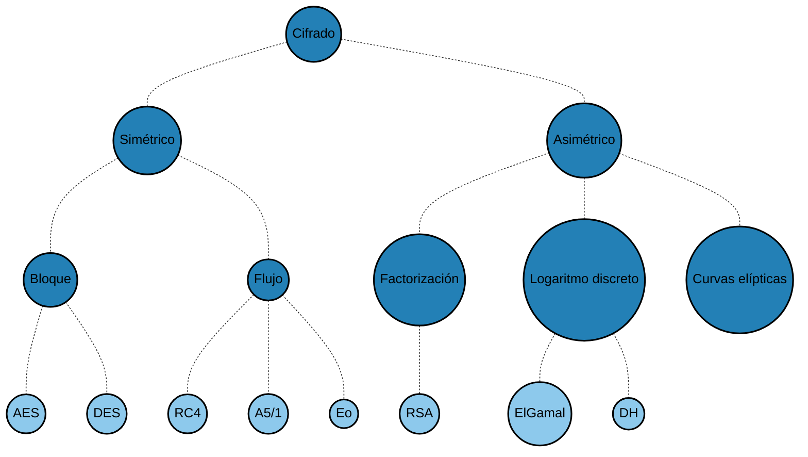
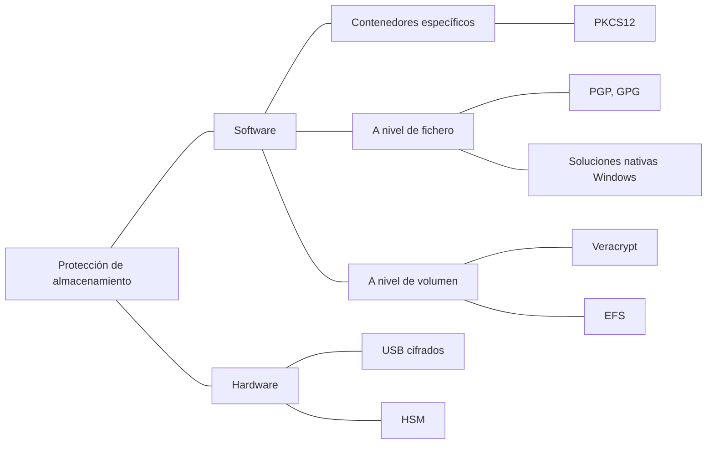

# Módulo 4: Arquitecturas y protocolos de seguridad. Tema 1: Fundamentos de criptografía
## Introducción
### Seguridad de la información
La seguridad de la información se basa en tres grandes pilares: la confidencialidad, autenticación e integridad, cada uno con sus mecanismos para asegurarlo.

### Terminología
La criptología engloba la criptografía y el criptoanálisis. No se dice encriptar llave, sino cifrar clave y un texto no cifrado se denomina un texto en claro y un texto cifrado se denomina texto cifrado o criptograma.

### Taxonomía del cifrado

## Cifrado simétrico
Uso de la misma clave para cifrar y descifrar, la longitud de la clave es corta (~200 bits), tiene alta velocidad, y su principal inconveniente es la distribución de claves.

### AES
Aes es un nuevo estándar de cifrado desde 2000. Fue diseñado para ser eficiente en microprocesadores de cualquier ancho de palabra, desde 8 bits, usados en tarjetas inteligentes o microcontroladores hasta CPUs de 64 bits.

La NSA elige AES en 2003 para cifrar su propia información clasificada como secreto y alto secreto

### Ataques por fuerza bruta

|Longitud de la clave|Tiempo necesario para romper la clave|
|--------------------|-------------------------------------|
|40 bits|2 segundos|
|48 bits|9 minutos|
|56 bits|40 horas|
|64 bits|14 meses|
|72 bits|305 años|
|80 bits|78.250 años|
|96 bits|5.127.160.311 años|
|112 bits|336.013.578.167.538 años|
|128 bits|22.020.985.858.787.784.059 años|
|192 bits|1.872 * 1037 años|
|256 bits|9.1 · 1050 años|

## Cifrado asimétrico
Uso de claves vinculadas matemáticamente (clave pública y privada), con el principio fundamental de que lo cifrado con una clave solo se puede descifrar con otra. La longitud de las claves son largas (~2000 bits) y la velocidad de operación es baja. A pesar de la baja velocidad se resuelve la problemática de la gestión de claves.

### Elementos básicos
Dos claves, denominadas pública y privada, vinculadas matemáticamente. Lo que se cifra con una de las claves, solo se puede descifrar con la otra.

### Algoritmo RSA
$p * q = n$  
Dado n, ¿cuales son p y q?
#### Aritmética modular

Si trabajamos en $\mathbb{Z}_n = \{0, 1, \ldots, n-1\}$, se cumplen las siguientes propiedades:

$$
(a + b) \bmod n = \left[(a \bmod n) + (b \bmod n)\right] \bmod n \tag{1}
$$

$$
(a - b) \bmod n = \left[(a \bmod n) - (b \bmod n)\right] \bmod n \tag{2}
$$

$$
(a \cdot b) \bmod n = \left[(a \bmod n) \cdot (b \bmod n)\right] \bmod n \tag{3}
$$

Ejemplos:

$$
11 \bmod 8 = 3; 15 \bmod 8 = 7
$$

$$
\left[(11 \bmod 8) + (15 \bmod 8)\right] \bmod 8 = [3 + 7 ] \bmod 8 = 10 \bmod 8 = 2
$$

$$
(11 + 15) \bmod 8 = 26 \bmod 8 = 2
$$ 

Exponenciacion:

Para encontrar $11^7 \bmod 13$, podemos hacer:  
$11^7 \bmod 13 = 19487171$ en módulo 13 (costoso)

O utilizar las propiedades anteriores;

Sabemos que $11^7 = 11^4 \cdot 11^2 \cdot 11$ y por la propiedad [3]:  
$11^2 = 121 \bmod 13 = 4$ en módulo 13  
$11^4 = (11^2)^2 \bmod 13 = 4^2 \bmod 13 = 3$ en módulo 13  
$11^7 = (11^4 \cdot 11^2 \cdot 11) \bmod 13 = (11 \cdot 4 \cdot 3) \bmod 13 = 132 \bmod 13 = 2$ en módulo 13  

#### Fundamentos matemáticos
Función $\phi$ de Euler

$\phi(n) =$ números enteros positivos coprimos con n

#### Generación de claves

1. Sean $p$ y $q$ dos números primos grandes.

2. Calcular:
   
   $$
   n = pq,\quad \phi(n) = (p - 1)(q - 1)
   $$

3. Elegir un número $e$ tal que:

   $$
   \mathrm{mcd}(\phi(n), e) = 1,\quad 1 < e < \phi(n)
   $$

4. Calcular $d$ tal que:

   $$
   d \equiv e^{-1} \pmod{\phi(n)} \quad \text{es decir} \quad d \cdot e \equiv 1 \pmod{\phi(n)}
   $$

Clave publica = {e, n}  
Clave privada = {d, n}

Ejemplo:

1. Elegimos $p = 3$ y $q = 11$.
2. Calculamos $n = p \cdot q = 3 \cdot 11 = 33$.
3. Calculamos $\phi(n) = (p-1) \cdot (q-1) = 2 \cdot 10 = 20$.
4. Elegimos e tal que $1<e<\phi(n)$ y e y n sean primos entre si. Por ejemplo, $e=7$.
5. Calculamos un valor para d tal que $(d \cdot 7) \equiv 1 \pmod{20}$. Una solucion es $d=3$

La clave pública es {e, n} = {7, 33}  
La clave privada es {d, n} = {3, 33}

#### Proceso de cifrado/descifrado
A cifra un mensaje m para B

1. Cifrado A debe:  
    1. Obtener la clave pública de B, (e, n)
    2. Representar el mensaje con un entero m en el intervalo [0, n-1]
    3. Calcular $c=m^e \pmod{n}$ y enviar a B.
2. Descifrado: Para recuperar el texto en claro de c, B debe:
    1. Usar su clave privada d, y calcular $m=c^d \pmod{n}$

**Ejemplo de cifrado**  
La clave pública es {e, n} = {7, 33}  
La clave privada es {d, n} = {3, 33}  

1. Cifrado del mensaje: USA TU ARMA!
2. Codificamos cada símbolo de forma numérica
    - Usando código ASCII. La única limitación es que ningún número puede ser mayor que el módulo 33
3. Ciframos cada símbolo (U=20 en ASCII)

$$
20^7 \pmod{33} = 26
$$

4. El descifrado es, simplemente

$$
26^3 \pmod{33} = 20
$$

#### Longitudes de clave

|Clave simétrica (bits)|Clave RSA (bits)|Estimación resistencia (años)|Clave ECC (bits)|
|-------------------|---------------------|----------------|----------------|
|80 |1024| 2006-2010| 160-223|
|112| 2048| 2030 |224-255|
|128| 3072| >2030 |256-383|
|256| 15360 (!)| - |512+|

## Integridad - Funciones hash
Las funciones hash tienen como objetivo tomar un mensaje de entrada con longitud variable y producir un valor hash de longitud fija.  

El cifrado es reversible, el hashing no.   

Es una verificación de integridad, de que el archivo no ha sido manipulado por nadie en lo que se enviaba.

Se puede combinar hashing junto a cifrado para obtener una firma digital, en la que se tiene un mensaje público M, el emisor hace un hash de ese mensaje (para que el receptor pueda comprobar que no ha sido manipulado) y después, para que solo el receptor pueda ver ese hash y que no sea fácil de manipular, lo cifra con su clave privada y lo publica.

El receptor coge el mensaje público y le realiza hash también. A la vez obtiene el mensaje del emisor y lo desencripta para obtener el hash del emisor, y por último compara los dos hashes, si son iguales la firma es válida y, por lo tanto, el mensaje no ha sido manipulado

Por último se pueden hacer distintas combinaciones con hash y criptografía, generando esquemas híbridos. Aquí hay un ejemplo:

En este esquema:

1. Se parte del mensaje original (texto plano) y se aplica una función hash al mismo. Ahora si el mensaje cambia, su hash cambiará por lo que se podrá comprobar la veracidad de este.
2. El hash se cifra con la clave privada del emisor. Esto genera la firma digital. Al usar la clave privada del emisor, se garantiza que solo él pudo haber firmado ese mensaje. Esto garantiza la autenticidad e integridad (si el mensaje cambia, la firma ya no es válida)
3. Se genera una clave simétrica aleatoria (por ejemplo AES). Esta clave se usa para cifrar el mensaje y la firma digital. El resultado es el mensaje cifrado. Una ventaja del uso de una clave simétrica en este paso es la rapidez y eficiencia al cifrar datos grandes
4. La clave simétrica usada en el paso 3 se cifra con la clave pública del receptor. Esto asegura que solo el receptor pueda descifrarla (usando su clave privada). Esto garantiza la confidencialidad de la clave de sesión.

Resultado final: El sobre digital contiene dos cosas:

1. El mensaje cifrado (que incluye el mensaje original y la firma digital).
2. La clave simétrica cifrada (que solo el receptor puede recuperar)

**¿Qué garantiza este esquema?**

| Propiedad            | Cómo se logra                                                                                 |
| -------------------- | --------------------------------------------------------------------------------------------- |
| **Confidencialidad** | Cifrado con clave simétrica + cifrado de la clave simétrica con la clave pública del receptor |
| **Autenticidad**     | Firma digital con clave privada del emisor                                                    |
| **Integridad**       | Hash del mensaje verificado con la firma digital                                              |

### Criptovirus - (Ransomware)
Cifra los documentos que encuentra, generalmente ofimáticos,
eliminando los originales y dejando un archivo de texto con las
Instrucciones para recuperarlos.

## Autenticación
Verificación de la identidad de otra parte. La otra parte puede ser una persona, aplicación, máquina, etc.

- Identificación: autenticación específica de personas.
- Autorización: gestión de los permisos de una parte ya autenticada.

### Contraseñas
Primer método de autenticación y aun el más utilizado. Son de fácil implementación y uso y no tienen coste. Por contraparte, son muy vulnerables a ataques.

### Sistemas 2F
El usuario debe demostrar, además del conocimiento de un secreto, la posesión de un token. Como ventaja, se añade una capa de seguridad.

Como desventaja, se puede perder o puede mal funcionar el token, requiere de hardware adicional, es más incómodo para el usuario y más complejo de implementar.

### Sistemas biométricos
Utilizan un rasgo biométrico para la identificación del usuario. Como ventaja, se añade una capa de seguridad, más segura que la autenticación por token.

Como desventaja, se puede robar las plantillas biométricas, es más incómodo para el usuario, tiene muchos potenciales problemas de privacidad y solo lo pueden usar ciertas personas.

## Almacenamiento seguro de certificados y claves

### Protecciones por software
#### Ventajas
Utilizar contenedores criptográficos específicos, como PKCS#12. Se pueden utilizar tanto para unidades de almacenamiento interno como externo, como USBs o discos duros.

#### Desventajas
Necesario instalar software en los ordenadores desde los que se desee almacenar información “segura” y recuperarla. Dependen de un único secreto (contraseña) para su protección.

#### Veracrypt
Veracrypt funciona mediante la creación de unidades virtuales o el cifrado de volúmenes completos. Estas unidades virtuales, o el volumen de cifrado contienen la información cifrada, incluyendo potencialmente claves y certificados.

- Las unidades virtuales se generan bajo demanda y se comportan como discos duros convencionales, pudiendo ser montadas y desmontadas por el usuario.
- El cifrado de todo el volumen en el que se encuentra un sistema instalado ofrece un alto nivel de seguridad, ya que todos los archivos del sistema (temporales, hibernación, nombre, localizaciones, etc.) se mantienen cifrados.

**Características Avanzadas**

- Autenticación previa al arranque (Pre-boot authentication): VeraCrypt utiliza su propio Boot Loader para autenticar a los usuarios antes de que se cargue el sistema operativo. Esto añade una capa crucial de seguridad, asegurando que no se pueda acceder al contenido cifrado sin la autenticación correcta, incluso si el sistema no está en funcionamiento.
- Volúmenes ocultos: VeraCrypt permite crear volúmenes ocultos que residen dentro de volúmenes convencionales y no pueden ser detectados a simple vista. Para lograrlo, se rellena el espacio escogido con información aleatoria, y la clave utilizada para el volumen escondido debe ser completamente diferente a la del volumen convencional. Esta característica proporciona una forma de negar plausiblemente la existencia de información sensible.

### Protecciones hardware
Como ventajas generales de las protecciones hardware, generalmente no necesitan ninguna instalación y se conectan como unidades de almacenamiento convencionales. La principal desventaja general es que son menos flexibles, ya que el software puede ser instalado en distintos tipos de dispositivos.

#### Hardware Security Modules (HSM)
HSM se basa tanto en el nivel físico como en el lógico. La seguridad fundamental de estos dispositivos reside en sus extremas medidas físicas anti-manipulación. Estas medidas se clasifican en:

- Pasivas: Buscan dificultar la inspección y manipulación de componentes activos y claves almacenadas. Ejemplos mencionados incluyen una simple carcasa de acero (útil combinada con seguridad física de acceso) y el peso adicional del dispositivo. Otro ejemplo es el encapsulado de todo el dispositivo en material anti-manipulación (resina epoxy).
- Activas: Estas detectan intentos de intrusión e inmediatamente destruyen todas las claves criptográficamente sensibles. Medidas activas:
    - Sensores térmicos: Protegen contra ataques por enfriamiento que pueden causar remanencia de datos en la memoria RAM.
    - Sensores de rayos X: Detectan esta radiación y borran las claves antes de que puedan ser "quemadas" en la RAM.
    - Sensores de luz: Borran las claves al detectar luz visible, aunque las fuentes señalan que pueden ser engañados con luz ultravioleta.
    - Sensores de movimiento: Se consideran más una medida antirrobo que anti-manipulación, útiles principalmente en un Centro de Proceso de Datos (CPD).
    - Membranas conductoras: Forman una malla alrededor del núcleo, son químicamente indistinguibles del encapsulado y borran las claves al ser expuestas.