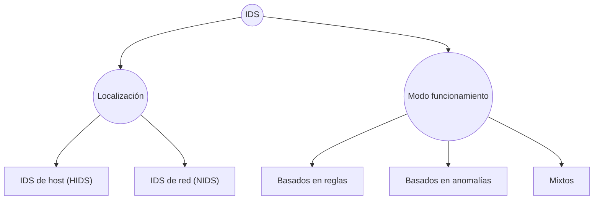

# Módulo 4: Arquitecturas y protocolos de seguridad. Tema 3: Sistemas IDS y señuelos
Una intrusión se define como una secuencia de acciones realizadas por un atacante que resulta en el compromiso de un sistema.


La detección de intrusión es el proceso de identificación y respuesta a estos intentos de ataques. Este proceso involucra tecnología, personas y herramientas.


La necesidad de los IDS radica en que, aunque existen otros mecanismos de seguridad como los cortafuegos y los antivirus, estos tienen limitaciones. Principalmente, otros mecanismos están pensados sobre todo para proteger del exterior. 


Sin embargo, casi el 50% de los ataques con éxito son llevados a cabo por usuarios internos del sistema. Esta es una razón crucial por la que los IDS son necesarios: pueden monitorear y detectar amenazas que se originan dentro de la red, algo para lo que los cortafuegos tradicionales no están diseñados. De hecho, se menciona que los IDS de host (HIDS) son más adecuados para combatir amenazas internas.


Adema de las amenazas internas, aunque un ataque no tenga éxito, es probable que alerte de su intento. Esta información puede ser muy útil para entender los tipos de ataques que se están dirigiendo a la red, aunque no logren su objetivo en ese momento.


En resumen, un sistema de detección de intrusión son los ojos de nuestra arquitectura de seguridad, que nos permite saber qué está pasando, dentro y fuera de nuestras redes.


Cuando se detecta un intento de ataque se genera una alerta, que debería ser revisada de inmediato por un operador humano.


- **Falso Positivo**: Se produce cuando un IDS genera una alerta falsa sobre un ataque que no se ha producido. La elevada tasa de falsos positivos es uno de los grandes inconvenientes de los IDS.
- **Falso Negativo**: Se produce cuando un IDS no detecta un ataque y no genera la alerta correspondiente. Es muy peligroso, porque un único falso negativo puede provocar que una intrusión no sea detectada.


## Cortafuegos vs. Antivirus vs. IDS


| Característica             | Cortafuegos                                            | Antivirus                                                  | IDS (Sistema de Detección de Intrusos)                   |
|---------------------------|--------------------------------------------------------|-------------------------------------------------------------|----------------------------------------------------------|
| **Qué vigilan**           | Tráfico de red y transporte                            | Archivos, procesos en ejecución, memoria RAM                | Comportamiento del sistema/red                          |
| **Cómo vigilan**          | Filtrado por IP, puertos, protocolos                   | Detección de firmas, análisis heurístico                    | Análisis basado en firmas y anomalías                   |
| **Nivel de operación**    | Red y transporte                                       | Sistema operativo y aplicaciones                            | Red (NIDS) o sistema operativo (HIDS)                   |
| **Reacción típica**       | Bloquear paquetes/conexiones                           | Poner en cuarentena, eliminar archivos, notificar           | Generar alertas, no intervienen directamente            |
| **Naturaleza de la acción** | Preventiva                                             | Reactiva                                                    | Pasiva (monitorización y alerta)                        |
| **Protección principal**  | Contra amenazas externas                               | Contra malware                                              | Contra amenazas internas y externas                     |
| **Ventajas**              | Control del tráfico en tiempo real                     | Eliminación directa del malware                             | Visibilidad completa del comportamiento del sistema     |
| **Limitaciones**          | No detecta malware ni amenazas internas sofisticadas   | Puede no detectar amenazas nuevas (zero-day)                | Puede generar falsos positivos o negativos              |
| **Rol en defensa en profundidad** | Primera línea de defensa                          | Protección del endpoint                                     | Detección de intrusiones en segundo plano              |


## Tipos de IDS
Los IDS se clasifican utilizando dos criterios: 





### IDS de Host (HIDS)
Los IDS de host son aquellos que monitorizan, detectan y responden a la actividad del usuario, del sistema y a ataques dirigidos a una máquina específica. La forma en que logran esto es examinando los parámetros del sistema operativo y el comportamiento del usuario a través de un agente:


- Uso de CPU y memoria.
- Monitorización de logs.
- Intentos fallidos de login.
- Monitorización del sistema de ficheros.


Son los más adecuados para combatir amenazas internas. Esto es crucial porque, como se ha visto anteriormente, la fuente de ataques más numerosa son los desempleados “deshonestos” o puertas traseras.


Aparte son muchos más baratos que los IDS de red (NIDS), con un coste estimado de 50 €/PC para HIDS frente a 8.000 € para NIDS.


Hay ciertos ataques que no son fácilmente detectados por los NIDS, lo que subraya la importancia de los HIDS como un complemento necesario.


Algunas soluciones open-source para UNIX son:


- TCPWrappers.
- Syslog.
- Swatch.
- Tripwire.
- OSSEC


### IDS de Red (NIDS)
Los IDS de Red tienen como función capturar y analizar todo el tráfico de un segmento de red, en busca de actividad maliciosa. Normalmente, para lograr esto, seutilizan dispositivos en modo promiscuo, lo que les permite ver todos los paquetes que pasan por el segmento de red, no solo aquellos dirigidos a la propia sonda.


La arquitectura de NIDS se compone de tres elementos principales:


- Sondas: Son elementos recolectores del sistema. Capturan el tráfico y realizan un primer paso de procesado. Posteriormente, envían los eventos generados al sistema gestor.
- Sistema gestor: Es el encargado de almacenar y gestionar los eventos recibidos. Se compone de una base de datos y un sistema de correlación de eventos.
- Consola de administración: Su función es clasificar y mostrar los eventos recibidos al operador.


Un aspecto crítico para el funcionamiento eficaz de un NIDS es la ubicación de las sondas. Esto es fundamental porque determina que trafico puede monitorizarse. Tradicionalmente, los NIDS han tenido problemas para trabajar en entornos conmutados. En principio, en estos entornos, sería necesaria una sonda por cada segmento de red para ver todo el tráfico relevante. Esto puede disparar los costes. 


Para abordar el desafío de los entornos conmutados, hay un par de soluciones existentes:


- Spanning ports: Algunos switches ofrecen un puerto de span (o de agregación) por el que se recibe una copia de todo el tráfico que pasa por el switch. Conectando la sonda a este puerto, esta puede ver todo el tráfico. Sin embargo, esta solución tiene algunos problemas: si el tráfico es muy alto, el switch puede tener problemas de rendimiento y descartar paquetes, y algunos switches solo permiten un puerto de span por VLAN.
- Uso de TAPs: Un TAP (Terminal Access Point) es un dispositivo hardware que se coloca en línea en un cable de datos y envía una copia del tráfico a uno o más puntos, como una sonda NIDS. Los TAPs no tienen problemas de rendimiento ni necesitan configuración. No obstante, se debe elegir su ubicación con cuidado, ya que pueden sobrecargar fácilmente las sondas si se colocan en puntos con demasiado tráfico.


### IDS basados en firmas
En cuanto a los métodos de detección utilizados, los NIDS, al igual que otros tipos de IDS, buscan comportamientos anómalos. Las fuentes explican que los IDS basados en firmas buscan patrones previamente definidos. Para los NIDS, esto significa buscar estos patrones en el tráfico de red. Cuando se detecta una concordancia con una regla o “firma”, se dispara la regla y se genera una alerta. Esta alerta se envía a una consola central para que un operador humano la analice y actúe en consecuencia.


- Para los IDS de red (NIDS), el parámetro monitorizado es el tráfico de red. Una firma simple podría ser: IF misma_dir_IP_origen AND diferentes_puerto_destino AND num_conexiones >= 10 THEN ALERT ("Escaneo de puertos"). Esto muestra cómo analizan patrones en el tráfico de red.
- Para los IDS de host (HIDS), los parámetros incluyen el sistema de ficheros, así como el uso de CPU y memoria, logs, intentos fallidos de login, entre otros. Una firma simple podría ser: IF número_intentos_login_último_minuto >= 10 AND mismo_usuario THEN ALERT ("Ataque de fuerza bruta contra cuenta de usuario"). Esto ilustra cómo monitorizan parámetros a nivel de host como los intentos de login.


Las firmas reales no son tan sencillas. Esta es una firma de Snort para detectar un tipo de ataque contra dispositivos Cisco:
```
alert tcp any any -> $HOME_NET 23 (msg: "BLEEDING-EDGE
EXPLOIT Cisco Telnet Buffer Overflow"; flow:
to_server,established; content:"|3f 3f 3f 3f 3f 3f 3f 3f 3f 3f 3f 3f 3f
3f 3f 3f 3f 61 7e 20 25 25 25 25 25 58 58|"; threshold: type limit,
track by_src, count 1, seconds 120;
reference:url,www.cisco.com/warp/public/707/cisco-sn-20040326-
exploits.shtml; classtype: attempted-dos; sid: 2000005; rev:4; )
```


## Snort
Snort es el mejor IDS libre y uno de los mejores de todo el mercado. Es un ejemplo prominente de un NIDS basado en firmas. Es muy extendido, fiable, con extensísima documentación y una comunidad muy activa que proporciona bases de reglas exactas y rápidamente actualizadas. Una ventaja clave de Snort es que su base de reglas se almacena en ficheros de texto plano, lo que permite un control total sobre ellas, a diferencia de muchos IDS comerciales que son "cajas negras" donde no se conoce ni se tiene control sobre la base de reglas, lo que dificulta reducir manualmente la tasa de falsos positivos


### Uso de Snort


